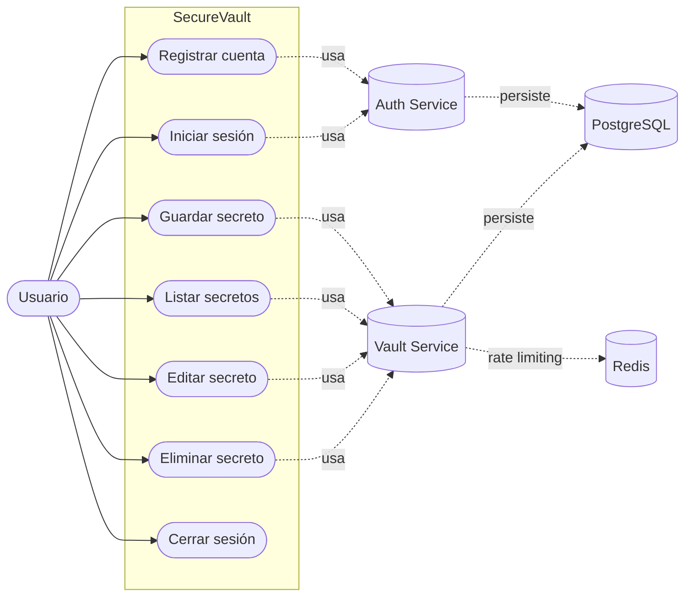

# Manual Técnico

## 1. Arquitectura general

SecureVault está implementado con arquitectura de microservicios ligeros:

- Frontend SPA (React + Vite) servido por Nginx.
- Auth Service (FastAPI): registro y login, emisión de JWT.
- Vault Service (FastAPI): CRUD de secretos por usuario autenticado.
- PostgreSQL: persistencia de usuarios y secretos.
- Redis: backend de rate limiting para Vault Service.
- Docker Compose: orquestación local.

## 2. Estructura de componentes

- frontend-spa/: interfaz React/Vite.
- auth-service/: autenticación y token JWT.
- vault-service/: gestión de bóveda con cifrado.
- nginx/: reverse proxy de entrada.
- docker-compose.yml: despliegue local integrado.

## 3. Diagrama de Casos de Uso

El siguiente diagrama resume las interacciones principales del usuario con el sistema SecureVault:



Cobertura funcional y trazabilidad:

- Registro e inicio de sesión: alineado con CP-01 a CP-04 del plan de pruebas.
- CRUD de secretos: alineado con CP-05 a CP-08 del plan de pruebas.
- Control de acceso y límites: relacionado con CP-09 y CP-10.

## 4. Modelo de datos

### Tabla users

- id: integer, PK.
- username: string, único.
- hashed_password: string.

### Tabla secrets

- id: integer, PK.
- site: string.
- encrypted_password: string.
- owner: string (usuario propietario).

## 5. Seguridad implementada

- Hash de contraseña: bcrypt mediante passlib.
- JWT firmado con HS256 y expiración configurable.
- Validación de token en endpoints de bóveda.
- Cifrado de secretos con Fernet.
- Rate limiting en vault: 10 requests/minute por IP.

## 6. Endpoints principales

### Auth Service

- POST /auth/register
- POST /auth/login

### Vault Service

- GET /vault/secret
- POST /vault/secret
- PUT /vault/secret/{secret_id}
- DELETE /vault/secret/{secret_id}

## 7. Variables y configuración

- database_url: conexión PostgreSQL.
- secret_key: clave de firma JWT.
- algorithm: algoritmo JWT (HS256).
- token_exp_minutes: expiración del token.
- ENCRYPTION_KEY: clave de cifrado de secretos recomendada para persistencia.

## 8. Notas técnicas relevantes

- Si ENCRYPTION_KEY no está definida, se genera una clave efímera y los secretos previos pueden no descifrarse tras reinicio.
- Nginx enruta /auth/ a auth y /vault/ a vault.
- El frontend consume rutas relativas /auth/_ y /vault/_.
- Se incluyen modelos de amenazas importables en OWASP Threat Dragon para arquitectura y cadena CI/CD.

## 9. Mejoras futuras sugeridas

- Migraciones formales con Alembic.
- Gestión segura de secretos con vault manager o variables protegidas.
- Endurecimiento de observabilidad (dashboards, alertas y correlación de eventos de seguridad).
- Pruebas automatizadas de integración.

## 10. Pipeline CI/CD DevSecOps en GitHub Actions

El repositorio ahora incluye un pipeline completo en GitHub Actions:

- CI + seguridad en `.github/workflows/ci-devsecops.yml`.
- Release de contenedores a GHCR en `.github/workflows/container-release.yml`.
- CD manual a producción por SSH en `.github/workflows/deploy-production.yml`.
- DAST automatizado con ZAP en `.github/workflows/dast-zap.yml`.
- IaC con Ansible en `iac/ansible/deploy-compose.yml`.

### Flujo recomendado

- Pull Request a `main`: ejecuta calidad, build y escaneos de seguridad.
- Push a `main`: construye y publica imágenes en GHCR y Docker Hub.
- Deploy: se ejecuta manualmente con `workflow_dispatch` sobre el entorno protegido.

### Secretos requeridos en GitHub

Configurar en Settings > Secrets and variables > Actions:

- `DEPLOY_HOST`: IP o dominio del servidor de despliegue.
- `DEPLOY_USER`: usuario SSH del servidor.
- `DEPLOY_SSH_KEY`: llave privada SSH para el servidor.
- `GHCR_USERNAME`: usuario con permisos para leer paquetes en GHCR.
- `GHCR_TOKEN`: token con scope `read:packages` para el servidor destino.
- `DOCKERHUB_USERNAME`: usuario de Docker Hub para publicación.
- `DOCKERHUB_TOKEN`: access token de Docker Hub para publicación.

### Protección recomendada

- Habilitar Branch Protection en `main` y exigir estado exitoso de los workflows de CI.
- Configurar el environment `production` con aprobación manual antes de ejecutar deploy.

### Compose de producción

- El archivo `docker-compose.prod.yml` consume imágenes de GHCR usando:
  - `GITHUB_REPOSITORY_OWNER`
  - `IMAGE_TAG`
- El workflow de deploy exporta ambas variables antes de ejecutar `docker compose`.

### Cobertura de seguridad implementada

- SAST: Bandit en servicios Python.
- SAST adicional: Semgrep sobre el repositorio.
- SCA: pip-audit y npm audit.
- Secret scan: Gitleaks y TruffleHog.
- Image scan: Trivy y Grype sobre imágenes publicadas.
- DAST: OWASP ZAP baseline contra el gateway del entorno levantado por compose.
- IaC scan: Checkov sobre Terraform, Dockerfile, Compose y Ansible.
- Shift-left local: pre-commit con Gitleaks y TruffleHog en `.pre-commit-config.yaml`.
- Pruebas automatizadas Python: pytest con cobertura sobre servicios auth y vault.
- Pruebas frontend: Vitest + Testing Library en `frontend-spa`.
- Monitor básico: Prometheus + Grafana + cAdvisor + Loki + Promtail + Falco en `docker-compose.prod.yml`.

### Política de bloqueo por severidad

- Trivy (filesystem e imágenes) bloquea en severidad `CRITICAL`.
- Grype bloquea en severidad `critical`.
- npm audit bloquea en severidad `critical`.
- Gitleaks, Checkov y Bandit bloquean al detectar hallazgos en sus políticas.

### Uso local de pre-commit

```powershell
pip install pre-commit
pre-commit install
```

### Monitoreo básico en producción

- Prometheus: `http://<host>:9090`
- Grafana: `http://<host>:3001`
- cAdvisor: `http://<host>:8080`
- Loki: `http://<host>:3100`

### Runtime security

- Falco se ejecuta como servicio de detección de comportamiento en runtime sobre el host Docker.
- Requiere soporte de kernel para eBPF moderno y privilegios elevados en el host destino.

### Cobertura de pruebas en CI

- El workflow de CI ejecuta `pytest --cov=app --cov-report=term-missing --cov-report=xml` en `auth-service` y `vault-service`.

## 11. Documentación de referencia

- [Manual de Usuario](docs/01_Manual_Usuario.md)
- [Manual Técnico](docs/02_Manual_Tecnico.md)
- [Manual de Operación y DevOps](docs/03_Manual_Operacion_DevOps.md)
- [Seguridad y Riesgos](docs/04_Seguridad_y_Riesgos.md)
- [Plan de Pruebas](docs/05_Plan_Pruebas.md)
- [Checklist de Entrega](docs/06_Checklist_Entrega.md)
