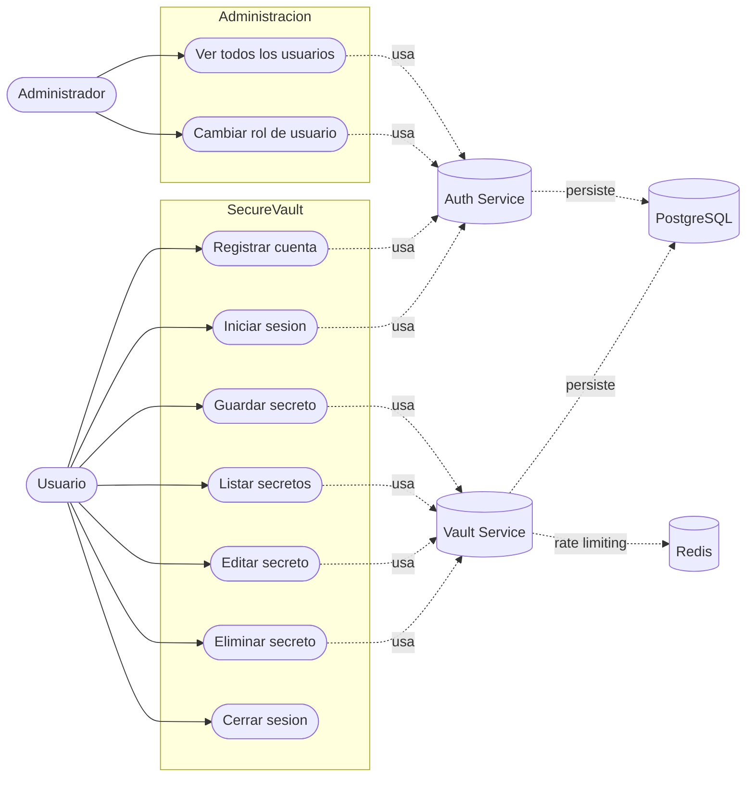
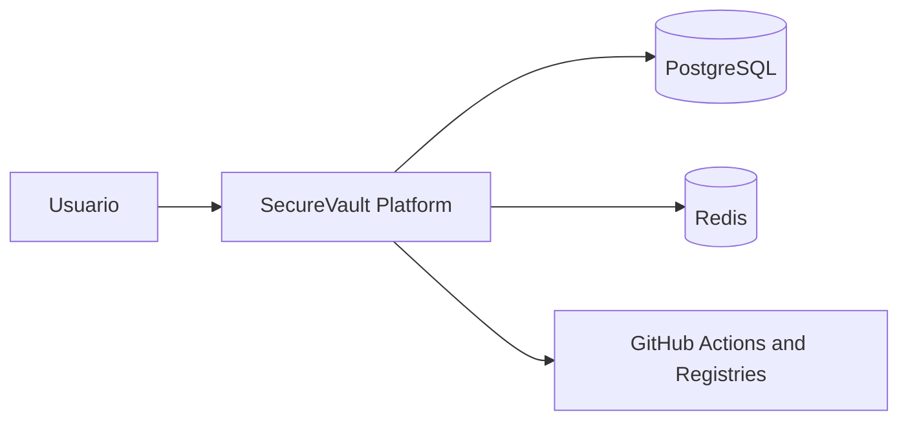
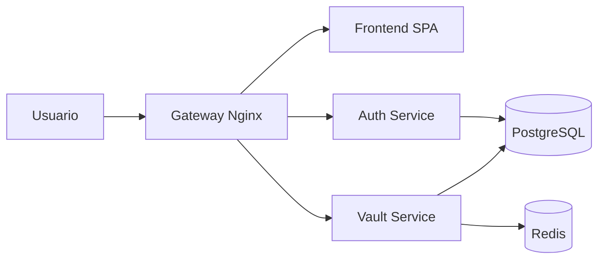
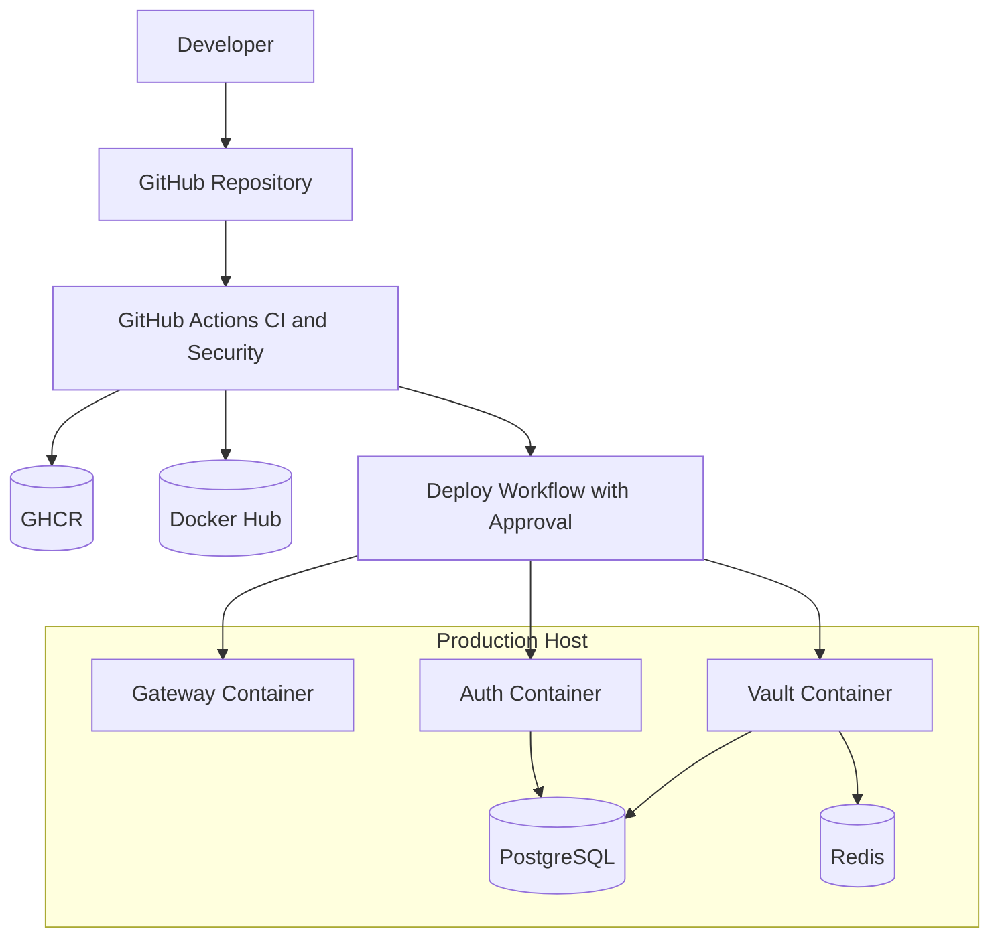
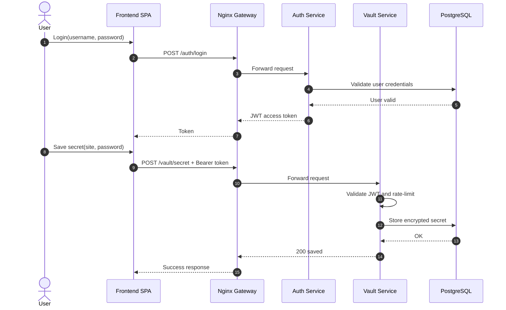
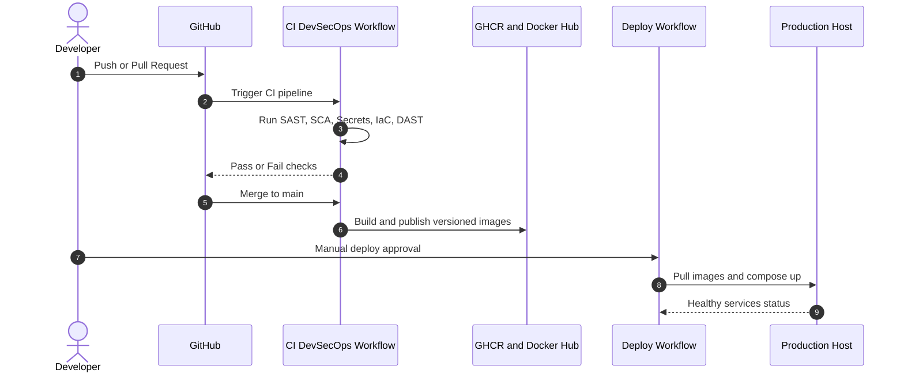

# Manual Tecnico

## 1. Arquitectura general

SecureVault esta implementado con arquitectura de microservicios ligeros:

- Frontend SPA (React + Vite) servido por Nginx.
- Auth Service (FastAPI): registro y login, emision de JWT.
- Vault Service (FastAPI): CRUD de secretos por usuario autenticado.
- Worker Service (Python): proceso asincrono para consumo de eventos de seguridad en segundo plano.
- PostgreSQL: persistencia de usuarios y secretos.
- Redis: backend de rate limiting para Vault Service.
- Docker Compose: orquestacion local.

## 2. Estructura de componentes

- frontend-spa/: interfaz React/Vite.
- servicios/auth-service/: autenticacion y token JWT.
- servicios/vault-service/: gestion de boveda con cifrado.
- servicios/worker-service/: worker asincrono para tareas desacopladas.
- infraestructura/ansible/: automatizacion IaC de despliegue.
- orquestacion/kubernetes/: manifests base para K3s/Kubernetes.
- nginx/: reverse proxy de entrada.
- docker-compose.yml: despliegue local integrado.

## 3. Diagrama de Casos de Uso

El siguiente diagrama resume las interacciones principales del usuario con el sistema SecureVault:

Cobertura funcional y trazabilidad:

- Registro e inicio de sesion: alineado con CP-01 a CP-04 del plan de pruebas.
- CRUD de secretos: alineado con CP-05 a CP-08 del plan de pruebas.
- Control de acceso y limites: relacionado con CP-09 y CP-10.

## 4. DFD Nivel 0 (Critico)

Este diagrama representa la vista de contexto del sistema, mostrando a SecureVault como una unidad frente al usuario y sus dependencias principales.

## 5. DFD Nivel 1 (Critico)

Este diagrama descompone SecureVault en sus procesos y almacenes principales.

## 6. Diagrama de Despliegue (Critico)

Este diagrama representa el despliegue DevSecOps con CI/CD, registros de imagenes y entorno productivo.

## 7. Diagrama de Secuencia Funcional (Critico)

Flujo principal de autenticacion y guardado de secreto.

## 8. Diagrama de Secuencia DevSecOps (Critico)

Flujo principal desde PR hasta despliegue productivo con controles de seguridad.

## 9. Modelo de datos

### Tabla users

- id: integer, PK.
- email: string, unico (identificador principal).
- hashed_password: string (bcrypt).
- role: string, valores posibles: `admin` o `user` (por defecto `user`).

Nota: el usuario administrador inicial se crea automaticamente al arrancar el servicio con las variables de entorno `BOOTSTRAP_ADMIN_EMAIL` y `BOOTSTRAP_ADMIN_PASSWORD`.

### Tabla secrets

- id: integer, PK.
- site: string (nombre del sitio o servicio).
- encrypted_password: string (cifrado Fernet).
- category: string (ej. password, api_key, token).
- description: string, opcional.
- owner: string (email del usuario propietario).
- expires_at: datetime, opcional (gestion por worker).

## 10. Seguridad implementada

- Hash de contrasena: bcrypt mediante passlib.
- JWT firmado con HS256 y expiracion configurable (60 minutos).
- Claim `sub` del JWT codificado como string (`str(user.id)`) conforme RFC 7519.
- Validacion de token en endpoints de boveda y administracion.
- Cifrado de secretos con Fernet (clave fija persistente via `ENCRYPTION_KEY`).
- Rate limiting en vault: 10 requests/minute por IP.
- Control de acceso basado en roles (RBAC): rol `admin` y rol `user`.
  - Usuario regular: accede solo a sus propios secretos.
  - Administrador: accede al panel de gestion de usuarios y puede cambiar roles.
  - Restriccion: un administrador no puede cambiar su propio rol.

## 11. Endpoints principales

### Auth Service

- POST /auth/register — registro de usuario (rol `user` por defecto)
- POST /auth/login — autenticacion y emision de JWT
- GET /auth/me — perfil del usuario autenticado (requiere JWT)
- GET /auth/users — lista todos los usuarios (solo admin)
- PATCH /auth/users/{user_id}/role — cambia el rol de un usuario (solo admin)

### Vault Service

- GET /vault/secret — lista secretos del usuario; admin ve todos
- POST /vault/secret — crea un nuevo secreto
- PUT /vault/secret/{secret_id} — actualiza un secreto existente
- DELETE /vault/secret/{secret_id} — elimina un secreto

## 12. Variables y configuracion

- `DATABASE_URL`: conexion PostgreSQL.
- `SECRET_KEY`: clave de firma JWT.
- `ALGORITHM`: algoritmo JWT (HS256).
- `TOKEN_EXP_MINUTES`: expiracion del token (por defecto 60).
- `ENCRYPTION_KEY`: clave Fernet de 32 bytes en base64 para cifrado persistente de secretos. Debe ser fija entre reinicios.
- `BOOTSTRAP_ADMIN_EMAIL`: email del administrador inicial creado automaticamente al arrancar auth-service.
- `BOOTSTRAP_ADMIN_PASSWORD`: contrasena del administrador inicial. Debe cumplir politica de seguridad.

## 13. Notas tecnicas relevantes

- Si `ENCRYPTION_KEY` no esta definida, se genera una clave efimera y los secretos previos no pueden descifrarse tras reinicio. Siempre debe definirse con una clave Fernet fija.
- El claim `sub` del JWT debe ser string por RFC 7519; PyJWT rechaza valores enteros. El codigo usa `str(user.id)`.
- Nginx enruta `/auth/` a auth-service y `/vault/` a vault-service.
- El frontend consume rutas relativas `/auth/*` y `/vault/*`.
- El enrutamiento del frontend es basado en rol:
  - Usuario con rol `user` en `/boveda` ve `DashboardPage` (boveda personal).
  - Usuario con rol `admin` en `/boveda` ve `AdminPage` (panel de administracion).
  - La ruta `/admin` esta protegida exclusivamente para administradores.
- El bootstrap de admin es idempotente: si el usuario ya existe, no se crea de nuevo.
- Vault publica eventos asincronos en Redis (`jobs:security_events`) y worker-service los procesa.
- Se incluye modelo DFD importable en OWASP Threat Dragon en `threat-model/01_SecureVault_Operativo_Threat_Dragon.json`.
- Se incluye modelo Threat Dragon para CI/CD en `threat-model/02_SecureVault_CICD_Threat_Dragon.json`.

## 14. Mejoras futuras sugeridas

- Migraciones formales con Alembic.
- Gestion segura de secretos con vault manager o variables protegidas.
- Observabilidad centralizada (logs estructurados, metricas, trazas).
- Pruebas automatizadas de integracion.
