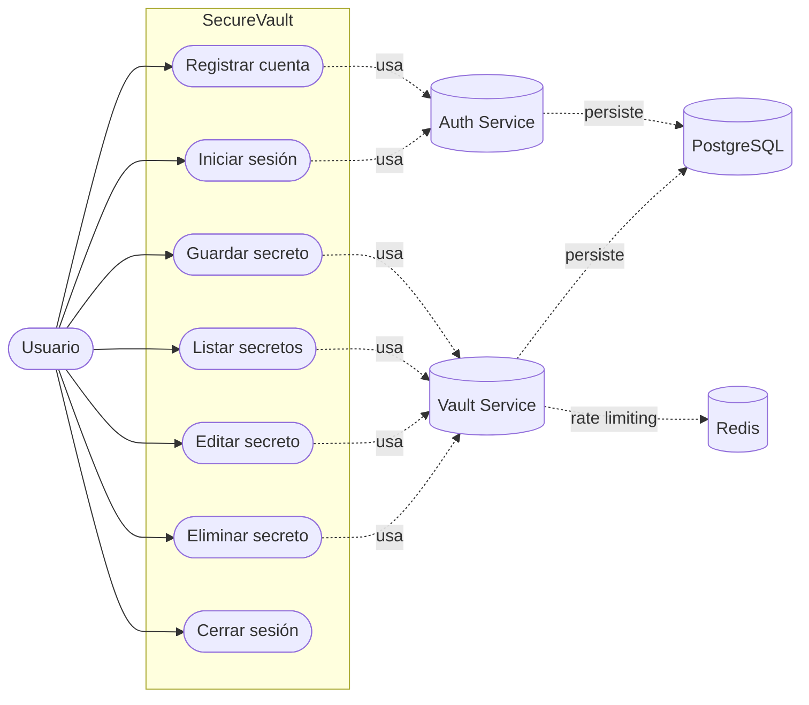

# Manual Técnico

## 1. Arquitectura general
SecureVault está implementado con arquitectura de microservicios ligeros:
- Frontend estático servido por Nginx.
- Auth Service (FastAPI): registro y login, emisión de JWT.
- Vault Service (FastAPI): CRUD de secretos por usuario autenticado.
- PostgreSQL: persistencia de usuarios y secretos.
- Redis: backend de rate limiting para Vault Service.
- Docker Compose: orquestación local.

## 2. Estructura de componentes
- frontend/: interfaz HTML/CSS/JS.
- auth-service/: autenticación y token JWT.
- vault-service/: gestión de bóveda con cifrado.
- nginx/: reverse proxy de entrada.
- docker-compose.yml: despliegue local integrado.

## 3. Diagrama de Casos de Uso
El siguiente diagrama resume las interacciones principales del usuario con el sistema SecureVault:

Cobertura funcional y trazabilidad:
- Registro e inicio de sesión: alineado con CP-01 a CP-04 del plan de pruebas.
- CRUD de secretos: alineado con CP-05 a CP-08 del plan de pruebas.
- Control de acceso y límites: relacionado con CP-09 y CP-10.

## 4. Modelo de datos
### Tabla users
- id: integer, PK.
- username: string, único.
- hashed_password: string.

### Tabla secrets
- id: integer, PK.
- site: string.
- encrypted_password: string.
- owner: string (usuario propietario).

## 5. Seguridad implementada
- Hash de contraseña: bcrypt mediante passlib.
- JWT firmado con HS256 y expiración configurable.
- Validación de token en endpoints de bóveda.
- Cifrado de secretos con Fernet.
- Rate limiting en vault: 10 requests/minute por IP.

## 6. Endpoints principales
### Auth Service
- POST /auth/register
- POST /auth/login

### Vault Service
- GET /vault/secret
- POST /vault/secret
- PUT /vault/secret/{secret_id}
- DELETE /vault/secret/{secret_id}

## 7. Variables y configuración
- database_url: conexión PostgreSQL.
- secret_key: clave de firma JWT.
- algorithm: algoritmo JWT (HS256).
- token_exp_minutes: expiración del token.
- ENCRYPTION_KEY: clave de cifrado de secretos recomendada para persistencia.

## 8. Notas técnicas relevantes
- Si ENCRYPTION_KEY no está definida, se genera una clave efímera y los secretos previos pueden no descifrarse tras reinicio.
- Nginx enruta /auth/ a auth y /vault/ a vault.
- El frontend consume rutas relativas /auth/* y /vault/*.

## 9. Mejoras futuras sugeridas
- Migraciones formales con Alembic.
- Gestión segura de secretos con vault manager o variables protegidas.
- Observabilidad centralizada (logs estructurados, métricas, trazas).
- Pruebas automatizadas de integración.
