# Manual Técnico — SecureVault Pro v1.2

## 1. Arquitectura general

SecureVault Pro está implementado con arquitectura de microservicios ligeros:

- **Frontend SPA** (React + Vite) servido por Nginx (gateway).
- **Auth Service** (FastAPI, Python 3.11): registro, login con bloqueo de cuenta, recuperación de contraseña, gestión de sesiones y administración RBAC.
- **Vault Service** (FastAPI, Python 3.11): CRUD de secretos cifrados por usuario autenticado.
- **Worker Service** (Python): proceso asíncrono para consumo de eventos de seguridad desde Redis.
- **PostgreSQL**: persistencia de usuarios, secretos, sesiones y auditoría.
- **Redis** (db=0 vault / db=1 auth): rate limiting, cola de eventos, contador de intentos fallidos de login (bloqueo de cuenta).
- **Mailjet API v3.1**: envío de emails de verificación y recuperación de contraseña.
- **Docker Compose**: orquestación local.

## 2. Estructura de componentes

```
securevault-pro/
├── frontend-spa/           # React + Vite, SPA con RBAC, bloqueo y recovery UI
├── servicios/
│   ├── auth-service/      # FastAPI — auth, JWT, RBAC, lockout, email, admin
│   ├── vault-service/     # FastAPI — secretos cifrados Fernet, compartir por email
│   └── worker-service/    # Python — eventos asíncronos vía Redis BLPOP
├── gateway/               # Nginx reverse proxy (enruta /auth/, /vault/)
├── infraestructura/       # Ansible IaC
├── orquestacion/          # Kubernetes/K3s manifests
└── monitoring/            # Prometheus, Grafana, Loki, Promtail, Falco
```

## 3. Diagrama de Casos de Uso — Completo v1.2

Cubre todos los actores y flujos incluyendo bloqueo, recuperación y administración en tiempo real.

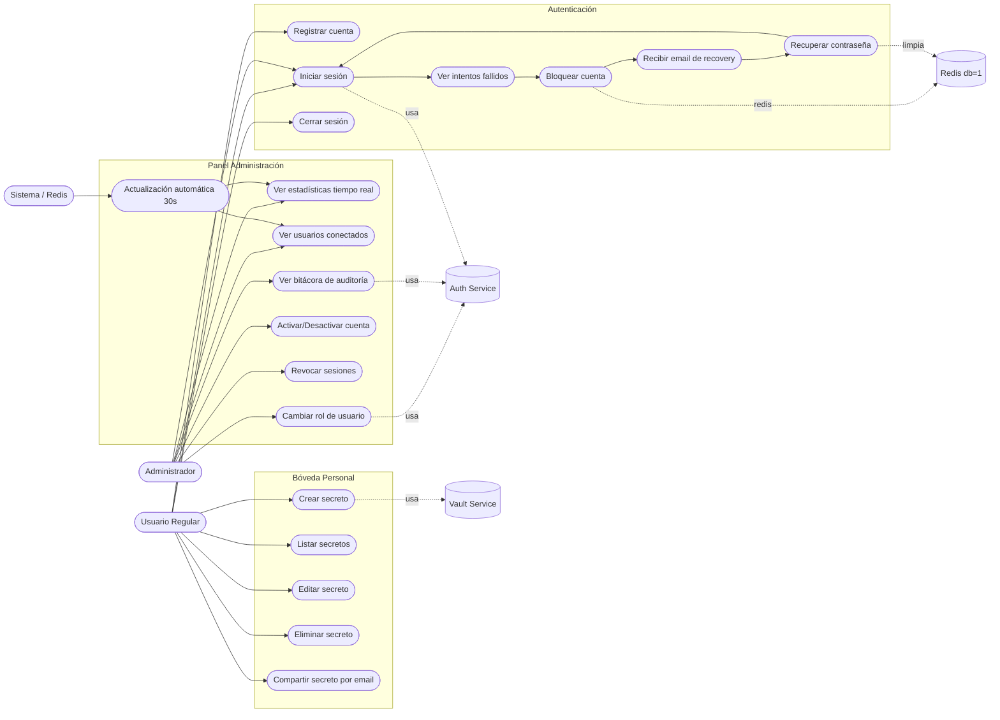

## 4. DFD Nivel 0 — Vista de Contexto

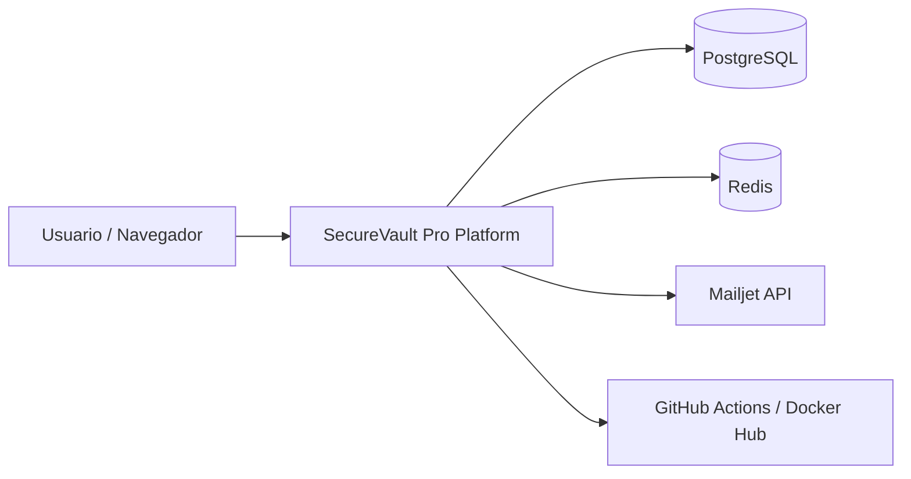

## 5. DFD Nivel 1 — Flujos internos

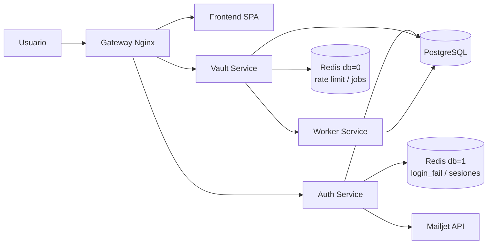

## 6. Diagrama de Despliegue

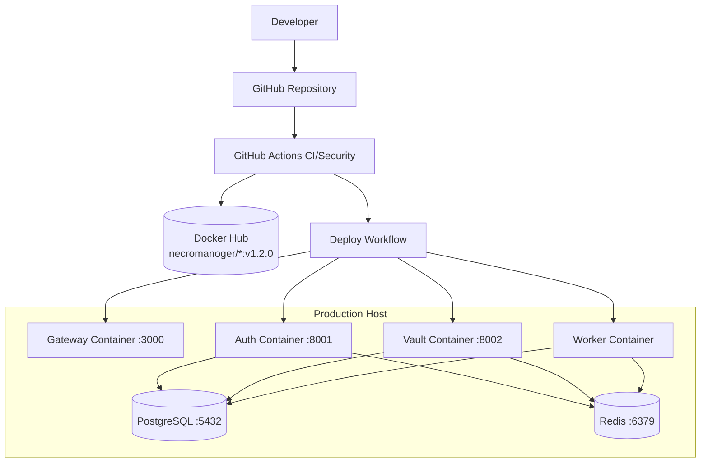

## 7. Diagrama de Secuencia — Login con bloqueo de cuenta

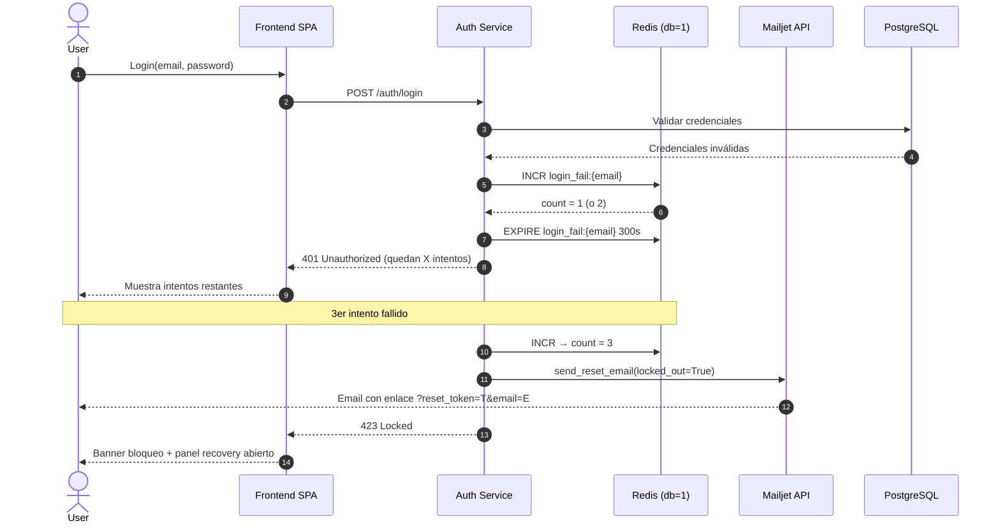

## 8. Diagrama de Secuencia — Recuperación de contraseña

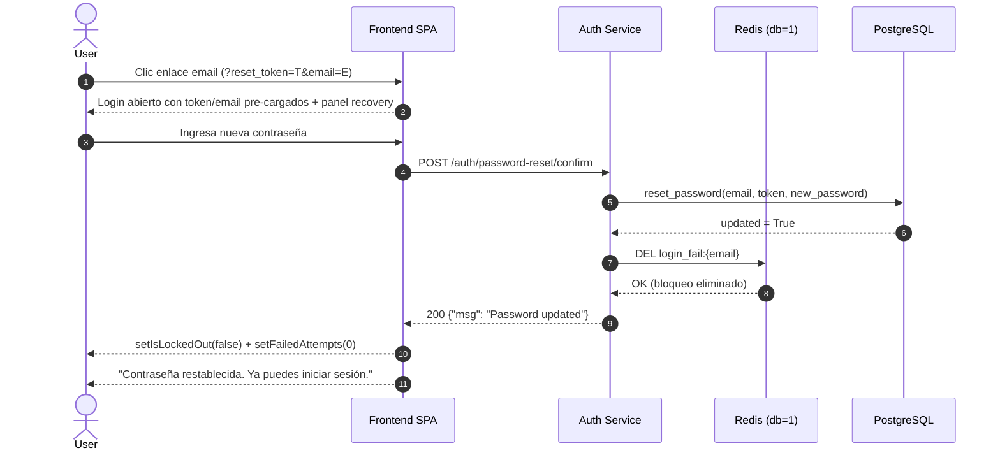

## 9. Diagrama de Secuencia — Panel Admin con polling

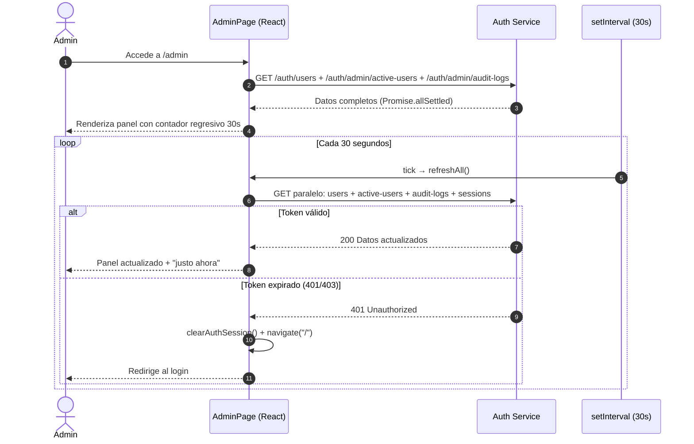

## 10. Diagrama de Secuencia — Login exitoso con JWT diferenciado

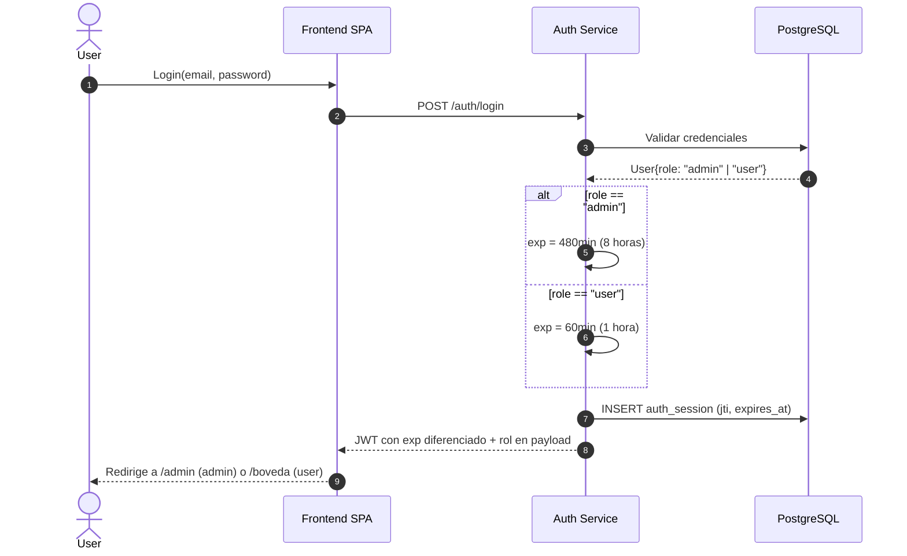

## 11. Diagrama de Secuencia DevSecOps (CI/CD)

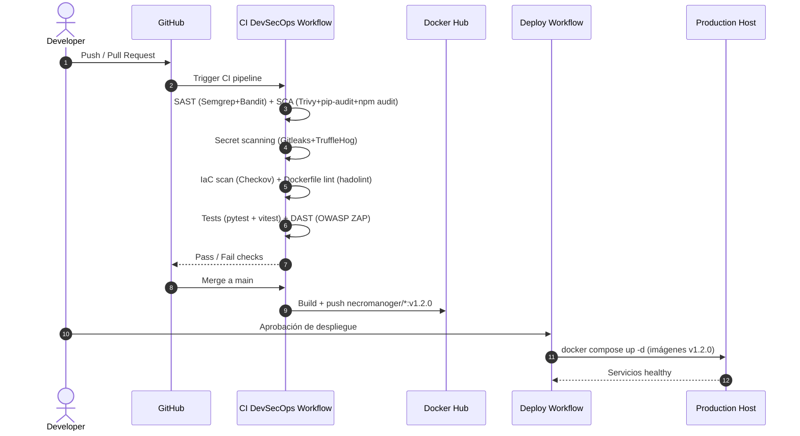

## 12. Modelo de datos

### Tabla `users`

| Campo | Tipo | Descripción |
|-------|------|-------------|
| id | integer PK | Identificador único |
| email | string unique | Identificador de login |
| hashed_password | string | bcrypt hash |
| role | string | `admin` o `user` (default `user`) |
| is_active | boolean | Estado de la cuenta |
| email_verified | boolean | Verificación de correo |

### Tabla `auth_session`

| Campo | Tipo | Descripción |
|-------|------|-------------|
| id | integer PK | Identificador único |
| user_id | integer FK | Referencia a users |
| token_jti | string | JWT ID único (para revocación) |
| issued_at | datetime | Emisión del token |
| expires_at | datetime | Expiración (60min user / 480min admin) |

### Tabla `secrets`

| Campo | Tipo | Descripción |
|-------|------|-------------|
| id | integer PK | Identificador único |
| site | string | Nombre del sitio o servicio |
| encrypted_password | string | Cifrado Fernet |
| category | string | password, api_key, token, etc. |
| description | string | Descripción opcional |
| owner | string | Email del propietario |
| expires_at | datetime | Expiración opcional |

### Claves Redis (auth, db=1)

| Clave | TTL | Descripción |
|-------|-----|-------------|
| `login_fail:{email}` | 300s | Contador intentos fallidos (bloqueo de cuenta) |

## 13. Seguridad implementada

- **Hash de contraseña**: bcrypt mediante passlib.
- **JWT HS256**: expiración diferenciada: 60 min (user) / 480 min (admin, configurable con `ADMIN_TOKEN_EXP_MINUTES`).
- **Claim `sub`**: string (str(user.id)), conforme RFC 7519.
- **Bloqueo de cuenta**: Redis TTL 300s, HTTP 423, reset limpia la clave automáticamente.
- **Email de recovery**: Mailjet API v3.1, HTML responsivo con enlace directo `?reset_token=TOKEN&email=EMAIL`.
- **Cifrado de secretos**: Fernet (clave fija persistente `ENCRYPTION_KEY`).
- **Rate limiting**: vault — 10 req/min por IP (SlowAPI + Redis).
- **RBAC**: rol validado en cada endpoint protegido; admin 403 si intenta acceder a rutas de user y viceversa.
- **Revocación de sesión**: via JTI en tabla `auth_session`; `POST /auth/users/{id}/sessions/revoke` invalida tokens activos.
- **Expiración automática en frontend**: polling detecta 401/403 y redirige al login con `clearAuthSession()`.
- **Separación de servicios**: Gateway Nginx separa frontend de backends.

## 14. Endpoints principales

### Auth Service (puerto 8001)

| Método | Ruta | Descripción | Auth |
|--------|------|-------------|------|
| POST | `/auth/register` | Registro de usuario | — |
| POST | `/auth/login` | Login + JWT (bloqueo a 3 intentos) | — |
| GET | `/auth/me` | Perfil autenticado | JWT |
| GET | `/auth/session/validate` | Validar sesión activa | JWT |
| POST | `/auth/password-reset/request` | Solicitar token de reset | — |
| POST | `/auth/password-reset/confirm` | Confirmar reset + limpiar Redis | — |
| POST | `/auth/confirm-email` | Verificar correo | — |
| GET | `/auth/users` | Listar usuarios | admin |
| PATCH | `/auth/users/{id}/role` | Cambiar rol | admin |
| PATCH | `/auth/users/{id}/status` | Activar/desactivar | admin |
| DELETE | `/auth/users/{id}` | Eliminar usuario | admin |
| GET | `/auth/users/{id}/sessions` | Ver sesiones | admin |
| POST | `/auth/users/{id}/sessions/revoke` | Revocar sesiones | admin |
| GET | `/auth/admin/active-users` | Usuarios conectados ahora | admin |
| GET | `/auth/admin/audit-logs` | Bitácora de auditoría | admin |

### Vault Service (puerto 8002)

| Método | Ruta | Descripción | Auth |
|--------|------|-------------|------|
| GET | `/vault/secret` | Listar secretos (user: propios; admin: todos) | JWT |
| POST | `/vault/secret` | Crear secreto | JWT |
| PUT | `/vault/secret/{id}` | Actualizar secreto | JWT |
| DELETE | `/vault/secret/{id}` | Eliminar secreto | JWT |
| POST | `/vault/secret/{id}/share` | Compartir secreto por email | JWT |

## 15. Variables de configuración

| Variable | Servicio | Default | Descripción |
|----------|----------|---------|-------------|
| `DATABASE_URL` | auth, vault | postgresql://... | Conexión PostgreSQL |
| `SECRET_KEY` | auth | securevaultsecret | Clave firma JWT |
| `ALGORITHM` | auth | HS256 | Algoritmo JWT |
| `TOKEN_EXP_MINUTES` | auth | 60 | Expiración JWT para rol `user` |
| `ADMIN_TOKEN_EXP_MINUTES` | auth | 480 | Expiración JWT para rol `admin` |
| `ENCRYPTION_KEY` | vault | (Fernet key) | Clave cifrado secretos (fija y persistente) |
| `BOOTSTRAP_ADMIN_EMAIL` | auth | admin@securevault.local | Email admin inicial |
| `BOOTSTRAP_ADMIN_PASSWORD` | auth | AdminSecure123!@# | Contraseña admin inicial |
| `REQUIRE_EMAIL_VERIFICATION` | auth | true | Verificación de correo al registrar |
| `MAILJET_API_KEY` | auth, vault | — | API Key Mailjet |
| `MAILJET_SECRET_KEY` | auth, vault | — | Secret Key Mailjet |
| `MAILJET_SENDER_EMAIL` | auth, vault | — | Email remitente |
| `MAILJET_SENDER_NAME` | auth, vault | SecureVault Pro | Nombre remitente |

## 16. Notas técnicas relevantes

- `login_fail:{email}` en Redis (db=1) se incrementa por cada intento fallido y se elimina al resetear contraseña o tras TTL de 5 min.
- El endpoint `POST /auth/login` es `async def` para poder hacer `await send_reset_email()` en el tercer fallo.
- `build_access_token()` en `auth_service.py` elige `exp_minutes` según `user.role` antes de llamar a `create_access_token()`.
- El frontend usa `Promise.allSettled` en `refreshAll()` para que un fallo parcial no bloquee las demás cargas. Si alguno lanza `SessionExpiredError`, todos los intervalos se detienen y se redirige.
- `SessionExpiredError` es una clase personalizada en `users.js` que permite distinguir 401/403 de errores de red genéricos.
- El contador regresivo del admin panel usa un `setInterval` separado (tick de 1s) desacoplado del intervalo de polling (30s) para evitar desincronización.
- Nginx enruta `/auth/` a auth-service:8001 y `/vault/` a vault-service:8002. El frontend consume rutas relativas.
- Bootstrap de admin es idempotente: si ya existe, no se crea ni modifica.

## 17. Mejoras futuras sugeridas

- Migraciones formales con Alembic.
- Refresh tokens para evitar relogin al expirar la sesión de usuario.
- WebSockets para actualización en tiempo real del panel admin sin polling.
- Gestión de secretos con Vault Manager o variables protegidas en CI.
- Observabilidad centralizada (métricas, trazas distribuidas).
- MFA (TOTP) como segundo factor de autenticación.


- Frontend SPA (React + Vite) servido por Nginx.
- Auth Service (FastAPI): registro y login, emision de JWT.
- Vault Service (FastAPI): CRUD de secretos por usuario autenticado.
- Worker Service (Python): proceso asincrono para consumo de eventos de seguridad en segundo plano.
- PostgreSQL: persistencia de usuarios y secretos.
- Redis: backend de rate limiting para Vault Service.
- Docker Compose: orquestacion local.

## 2. Estructura de componentes

- frontend-spa/: interfaz React/Vite.
- servicios/auth-service/: autenticacion y token JWT.
- servicios/vault-service/: gestion de boveda con cifrado.
- servicios/worker-service/: worker asincrono para tareas desacopladas.
- infraestructura/ansible/: automatizacion IaC de despliegue.
- orquestacion/kubernetes/: manifests base para K3s/Kubernetes.
- nginx/: reverse proxy de entrada.
- docker-compose.yml: despliegue local integrado.

## 3. Diagrama de Casos de Uso

El siguiente diagrama resume las interacciones principales del usuario con el sistema SecureVault:


Cobertura funcional y trazabilidad:

- Registro e inicio de sesion: alineado con CP-01 a CP-04 del plan de pruebas.
- CRUD de secretos: alineado con CP-05 a CP-08 del plan de pruebas.
- Control de acceso y limites: relacionado con CP-09 y CP-10.

## 4. DFD Nivel 0 (Critico)

Este diagrama representa la vista de contexto del sistema, mostrando a SecureVault como una unidad frente al usuario y sus dependencias principales.

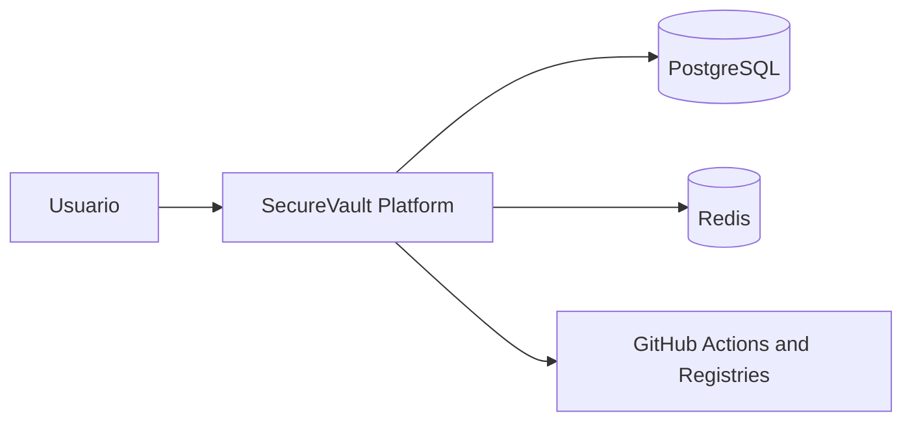

## 5. DFD Nivel 1 (Critico)

Este diagrama descompone SecureVault en sus procesos y almacenes principales.

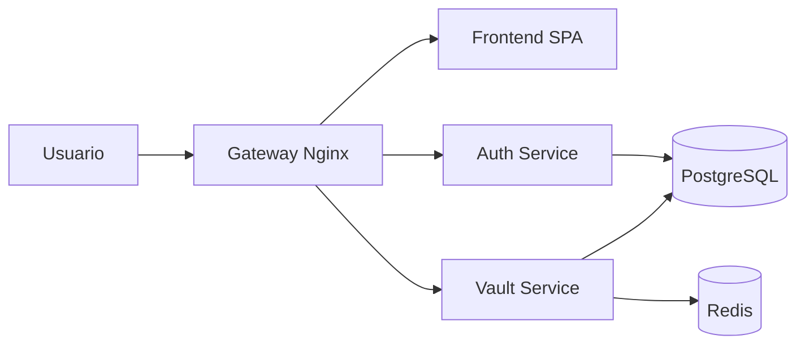

## 6. Diagrama de Despliegue (Critico)

Este diagrama representa el despliegue DevSecOps con CI/CD, registros de imagenes y entorno productivo.

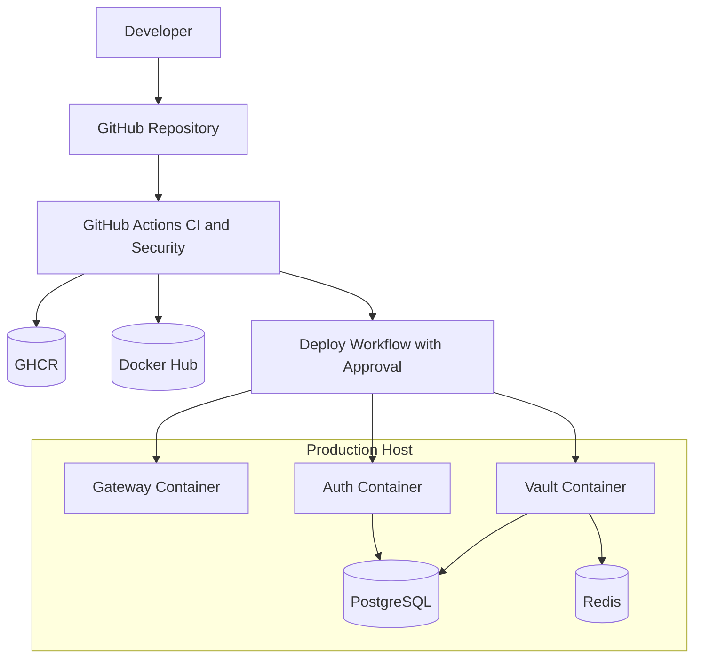

## 7. Diagrama de Secuencia Funcional (Critico)

Flujo principal de autenticacion y guardado de secreto.

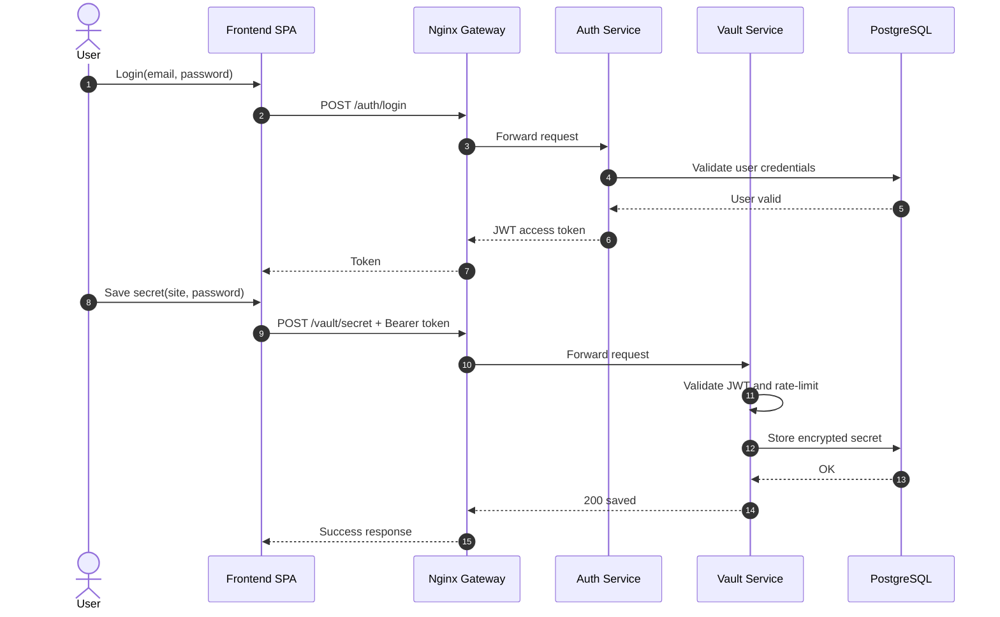

## 8. Diagrama de Secuencia DevSecOps (Critico)

Flujo principal desde PR hasta despliegue productivo con controles de seguridad.

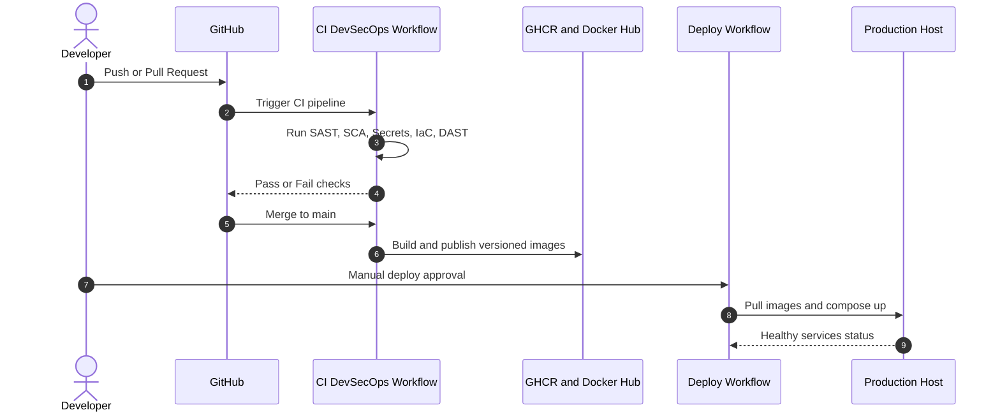

## 9. Modelo de datos

### Tabla users

- id: integer, PK.
- email: string, unico (identificador principal).
- hashed_password: string (bcrypt).
- role: string, valores posibles: `admin` o `user` (por defecto `user`).

Nota: el usuario administrador inicial se crea automaticamente al arrancar el servicio con las variables de entorno `BOOTSTRAP_ADMIN_EMAIL` y `BOOTSTRAP_ADMIN_PASSWORD`.

### Tabla secrets

- id: integer, PK.
- site: string (nombre del sitio o servicio).
- encrypted_password: string (cifrado Fernet).
- category: string (ej. password, api_key, token).
- description: string, opcional.
- owner: string (email del usuario propietario).
- expires_at: datetime, opcional (gestion por worker).

## 10. Seguridad implementada

- Hash de contrasena: bcrypt mediante passlib.
- JWT firmado con HS256 y expiracion configurable (60 minutos).
- Claim `sub` del JWT codificado como string (`str(user.id)`) conforme RFC 7519.
- Validacion de token en endpoints de boveda y administracion.
- Cifrado de secretos con Fernet (clave fija persistente via `ENCRYPTION_KEY`).
- Rate limiting en vault: 10 requests/minute por IP.
- Control de acceso basado en roles (RBAC): rol `admin` y rol `user`.
  - Usuario regular: accede solo a sus propios secretos.
  - Administrador: accede al panel de gestion de usuarios y puede cambiar roles.
  - Restriccion: un administrador no puede cambiar su propio rol.

## 11. Endpoints principales

### Auth Service

- POST /auth/register — registro de usuario (rol `user` por defecto)
- POST /auth/login — autenticacion y emision de JWT
- GET /auth/me — perfil del usuario autenticado (requiere JWT)
- GET /auth/users — lista todos los usuarios (solo admin)
- PATCH /auth/users/{user_id}/role — cambia el rol de un usuario (solo admin)

### Vault Service

- GET /vault/secret — lista secretos del usuario; admin ve todos
- POST /vault/secret — crea un nuevo secreto
- PUT /vault/secret/{secret_id} — actualiza un secreto existente
- DELETE /vault/secret/{secret_id} — elimina un secreto

## 12. Variables y configuracion

- `DATABASE_URL`: conexion PostgreSQL.
- `SECRET_KEY`: clave de firma JWT.
- `ALGORITHM`: algoritmo JWT (HS256).
- `TOKEN_EXP_MINUTES`: expiracion del token (por defecto 60).
- `ENCRYPTION_KEY`: clave Fernet de 32 bytes en base64 para cifrado persistente de secretos. Debe ser fija entre reinicios.
- `BOOTSTRAP_ADMIN_EMAIL`: email del administrador inicial creado automaticamente al arrancar auth-service.
- `BOOTSTRAP_ADMIN_PASSWORD`: contrasena del administrador inicial. Debe cumplir politica de seguridad.

## 13. Notas tecnicas relevantes

- Si `ENCRYPTION_KEY` no esta definida, se genera una clave efimera y los secretos previos no pueden descifrarse tras reinicio. Siempre debe definirse con una clave Fernet fija.
- El claim `sub` del JWT debe ser string por RFC 7519; PyJWT rechaza valores enteros. El codigo usa `str(user.id)`.
- Nginx enruta `/auth/` a auth-service y `/vault/` a vault-service.
- El frontend consume rutas relativas `/auth/*` y `/vault/*`.
- El enrutamiento del frontend es basado en rol:
  - Usuario con rol `user` en `/boveda` ve `DashboardPage` (boveda personal).
  - Usuario con rol `admin` en `/boveda` ve `AdminPage` (panel de administracion).
  - La ruta `/admin` esta protegida exclusivamente para administradores.
- El bootstrap de admin es idempotente: si el usuario ya existe, no se crea de nuevo.
- Vault publica eventos asincronos en Redis (`jobs:security_events`) y worker-service los procesa.
- Se incluye modelo DFD importable en OWASP Threat Dragon en `threat-model/01_SecureVault_Operativo_Threat_Dragon.json`.
- Se incluye modelo Threat Dragon para CI/CD en `threat-model/02_SecureVault_CICD_Threat_Dragon.json`.

## 14. Mejoras futuras sugeridas

- Migraciones formales con Alembic.
- Gestion segura de secretos con vault manager o variables protegidas.
- Observabilidad centralizada (logs estructurados, metricas, trazas).
- Pruebas automatizadas de integracion.
