# SecureVault Pro
## Guia de Documentacion Detallada y Analisis Tecnico

**Proyecto:** SecureVault Pro  
**Repositorio:** https://github.com/johngutierrez80/Securevault-pro  
**Fecha de analisis:** 10 de mayo de 2026  
**Version del documento:** 1.2  
**Tipo de entrega:** Guia explicativa academica con enfoque DevSecOps

---

## Portada

**Titulo completo:**  
SecureVault Pro: Arquitectura, Politicas de Seguridad, Herramientas DevSecOps y Analisis Profundo de Implementacion

**Descripcion:**  
Este documento presenta un analisis tecnico y pedagogico del proyecto SecureVault Pro, explicando en detalle la arquitectura de microservicios, el rol de cada modulo, las politicas de seguridad aplicadas y la forma en que las herramientas DevSecOps vigilan y refuerzan la proteccion del sistema a lo largo de todo el ciclo de vida del software.

**Publico objetivo:**  
- Lectores academicos (especializacion en ciberseguridad y DevSecOps)
- Evaluadores tecnicos
- Equipos de desarrollo que busquen referencia de buenas practicas

---

## Tabla de Contenido

1. Introduccion y alcance
2. Metodologia de analisis
3. Vision general de la arquitectura
4. Desglose profundo por componente
5. Politicas de seguridad implementadas y que vigilan
6. Herramientas de seguridad y monitoreo (analisis academico profundo)
7. Pipeline DevSecOps de extremo a extremo
8. Riesgos identificados, mitigaciones y brechas residuales
9. Evidencia visual: capturas de pantalla por seccion
10. Conclusiones y recomendaciones
11. Anexos

---

## 1. Introduccion y alcance

SecureVault Pro es una plataforma para gestion segura de secretos construida como laboratorio real de DevSecOps. El proyecto integra microservicios en Python/FastAPI, frontend en React/Vite, datos en PostgreSQL, eventos y control de tasa con Redis, enrutamiento por Nginx, despliegue contenerizado, pipeline CI/CD con multiples controles de seguridad y una capa operativa de observabilidad y deteccion de amenazas.

El alcance de esta guia cubre:

- Que hace cada modulo del sistema.
- Con que herramientas trabaja cada modulo.
- Como se implementan las politicas de seguridad en codigo y configuracion.
- Que herramientas revisan cada fase del ciclo Plan-Code-Build-Test-Release-Operate.
- Que riesgos se vigilan, cuales se mitigan y que recomendaciones quedan para produccion robusta.

---

## 2. Metodologia de analisis

El analisis se construye sobre evidencia directa del repositorio:

- Documentacion tecnica y de seguridad en `docs/`.
- Configuracion de despliegue en `docker-compose.yml` y `docker-compose.prod.yml`.
- Workflows de CI/CD en `ci-devsecops.yml`, `dast-zap.yml`, `container-release.yml` y `deploy-production.yml`.
- Estandarizacion de chequeos locales en `trunk.yaml` y archivos de configuracion de linters asociados.
- Configuracion de monitoreo en `monitoring/`.
- Codigo de microservicios en `servicios/`.
- Frontend SPA en `frontend-spa/`.
- Modelos de amenazas en `threat-model/`.

Enfoque pedagogico aplicado en cada seccion:

- Definicion simple.
- Funcion operativa real.
- Implementacion puntual en el repositorio.
- Politica de seguridad o riesgo que vigila.
- Explicacion educativa con analogia practica.

---

## 3. Vision general de la arquitectura

### 3.1 Diagrama general del sistema

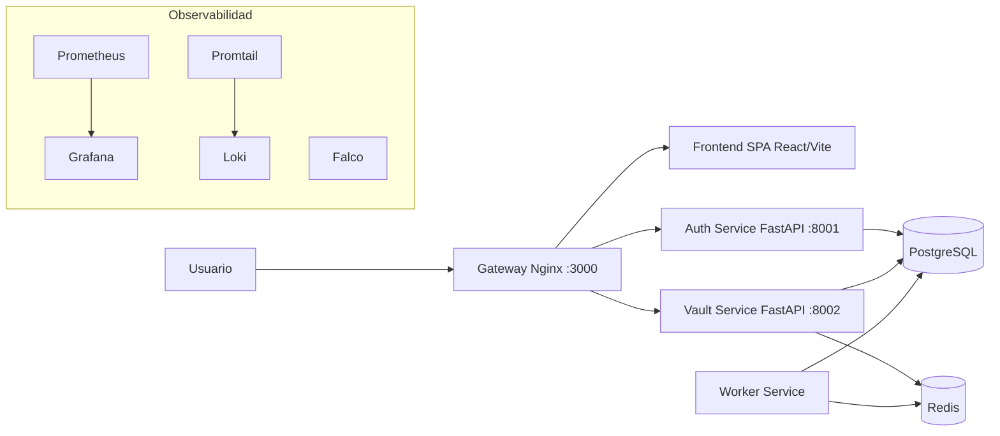

### 3.2 Funcionamiento en lenguaje simple

El sistema actua como una boveda digital: el usuario entra por una unica puerta (Gateway), se autentica (Auth Service), guarda y consulta secretos cifrados (Vault Service), y tareas de fondo como expiracion o eventos se procesan sin bloquear la aplicacion principal (Worker). Todo ocurre bajo vigilancia de herramientas de seguridad y monitoreo.

---

## 4. Desglose profundo por componente

## 4.1 Frontend SPA (React + Vite)

**Funcion principal:**  
Interfaz de usuario para registro, login, gestion de secretos y administracion de usuarios segun rol.

**Herramientas usadas:**  
- React para componentes y estado.
- Vite para build rapido y empaquetado.
- React Router para navegacion y proteccion de rutas.
- Nginx para servir archivos estaticos en el contenedor frontend.

**Implementacion en el repositorio:**  
- Carpeta `frontend-spa/`.
- Flujo de login en `frontend-spa/src/pages/LoginPage.jsx`.
- El token se guarda en `localStorage` tras autenticacion exitosa.
- Enrutamiento basado en roles en `frontend-spa/src/App.jsx`:
  - `ProtectedRoute`: valida sesion via `GET /auth/me`; redirige a `/` si no hay token valido.
  - `RoleBasedRoute`: si el rol es `admin` renderiza `AdminPage`; si es `user` renderiza `DashboardPage`.
  - Ruta `/admin` protegida exclusivamente para administradores.
- `frontend-spa/src/pages/DashboardPage.jsx`: boveda personal del usuario (crear, ver, editar, eliminar secretos propios).
- `frontend-spa/src/pages/AdminPage.jsx`: panel de administracion con multiples secciones:
  - **Estadísticas**: total de usuarios, administradores, usuarios regulares, usuarios activos y usuarios conectados en tiempo real.
  - **Usuarios conectados ahora**: tabla con email, rol y sesiones activas por usuario con boton de revocacion individual.
  - **Usuarios registrados**: tabla con ID, email, estado (Activo/Inactivo), rol, y acciones (cambiar rol, activar/desactivar).
  - **Sesiones activas**: selector de usuario, tabla de sesiones con ID, fecha de emision y expiracion, boton para revocar todas las sesiones.
  - **Bitácora de auditoría**: registro cronologico de todas las acciones administrativas (cambio de rol, activacion/desactivacion, revocacion de sesiones).
- `frontend-spa/src/api/auth.js`: wrapper para login, perfil de usuario y validacion de sesion.
- `frontend-spa/src/api/vault.js`: wrapper para CRUD de secretos.
- `frontend-spa/src/api/users.js`: wrapper para gestion de usuarios, sesiones y auditoría (solo admin). Define la clase `SessionExpiredError` y la funcion `adminFetch()` que detecta respuestas HTTP 401/403 y lanza `SessionExpiredError`.
- **Polling automatico del panel admin** (`POLL_INTERVAL = 30` segundos): `AdminPage.jsx` usa `useRef` + `useCallback` + `Promise.allSettled` para refrescar todos los datos sin bloquear la UI ante fallos parciales. Incluye countdown visual y boton "Actualizar ahora".
- **Deteccion de sesion expirada**: si el polling detecta `SessionExpiredError`, se llama `clearAuthSession()` y se redirige automaticamente al login con `useNavigate`.
- `LoginPage.jsx` detecta HTTP 423 (cuenta bloqueada) y muestra aviso con flujo de recuperacion. Detecta `?reset_token=` en URL para pre-cargar panel de recovery.

**Politicas de seguridad relacionadas:**
- Control de acceso basado en token JWT y rol de usuario.
- Rutas protegidas por rol; acceso no autorizado redirige automaticamente.
- Riesgo documentado por almacenamiento de token en localStorage.
- Deteccion proactiva de sesion expirada sin esperar accion del usuario.

**Explicacion educativa profunda:**  
El frontend es la capa de atencion al usuario, no el lugar donde vive la seguridad central. El RBAC en frontend es UX y primera barrera de navegacion; la seguridad real se mantiene en el backend con validaciones de rol en cada endpoint. Cuando un administrador inicia sesion, ve un panel completamente diferente al de un usuario regular, reduciendo la superficie de error y mejorando la experiencia.

**Captura sugerida:**  
- Vista de `frontend-spa/src/App.jsx` mostrando `ProtectedRoute` y `RoleBasedRoute`.
- Vista de `frontend-spa/src/pages/AdminPage.jsx` con tabla de usuarios.
- Guardar como `docs/assets/capturas/01_frontend_login.png` y `docs/assets/capturas/01b_frontend_admin.png`.

## 4.2 Auth Service (FastAPI)

**Funcion principal:**  
Registro, login, emision de JWT y gestion de usuarios con control de acceso basado en roles (RBAC).

**Herramientas usadas:**  
- FastAPI para API REST.
- passlib/bcrypt para hash de contrasenas.
- PyJWT para firma y validacion de tokens.
- SQLAlchemy para persistencia en PostgreSQL.
- Pydantic Settings para configuracion via variables de entorno.

**Implementacion en el repositorio:**  
- `servicios/auth-service/app/core/security.py`: hash y verificacion bcrypt.
- `servicios/auth-service/app/utils/jwt.py`: creacion y verificacion de token con expiracion.
- `servicios/auth-service/app/models/user.py`: modelo ORM con columna `is_active` para estado de cuenta.
- `servicios/auth-service/app/models/auth_session.py`: modelo ORM para tracking de sesiones activas con JTI (JWT ID).
- `servicios/auth-service/app/models/admin_audit_log.py`: modelo ORM para bitácora de acciones administrativas.
- `servicios/auth-service/app/services/auth_service.py`: logica de negocio incluyendo `bootstrap_initial_admin()`, `build_access_token()` con JTI, gestion de sesiones y auditoría.
- `servicios/auth-service/app/routers/auth.py`: endpoints para autenticacion, gestion de usuarios y administracion.
- `servicios/auth-service/app/core/config.py`: variables `BOOTSTRAP_ADMIN_EMAIL` y `BOOTSTRAP_ADMIN_PASSWORD`.
- `servicios/auth-service/app/main.py`: hook de startup que llama `bootstrap_initial_admin()` al arrancar.

**Endpoints de autenticacion:**
- `POST /auth/register`: crear nueva cuenta de usuario.
- `POST /auth/login`: obtener JWT con JTI (session ID).
- `GET /auth/me`: obtener perfil del usuario autenticado.
- `GET /auth/session/validate`: validar JWT activo y no revocado.

**Endpoints RBAC de administracion (solo admin):**
- `GET /auth/users`: lista todos los usuarios registrados con estado y rol.
- `PATCH /auth/users/{user_id}/role`: cambiar el rol de un usuario (user ↔ admin).
- `PATCH /auth/users/{user_id}/status`: activar o desactivar una cuenta de usuario.
- `GET /auth/users/{user_id}/sessions`: listar sesiones activas de un usuario.
- `POST /auth/users/{user_id}/sessions/revoke`: revocar todas las sesiones de un usuario.
- `GET /auth/admin/active-users`: listar usuarios conectados en tiempo real con contador de sesiones.
- `GET /auth/admin/audit-logs`: acceso a bitácora de auditoría.

**Politicas de seguridad relacionadas:**
- No almacenar contrasenas en texto plano.
- Tokens firmados con HS256 con **expiracion diferenciada por rol**: 60 minutos para `user`, 480 minutos (8 horas) para `admin`.
- Claim `sub` como string conforme RFC 7519.
- Cada token incluye un JTI (JWT ID) unico para trazabilidad y revocacion de sesiones.
- Administrador inicial creado de forma segura via variables de entorno, no hardcodeado en codigo.
- Endpoints de gestion protegidos por rol; 403 Forbidden si no es administrador.
- **Bloqueo automatico de cuenta**: tras 3 intentos de login fallidos, se registra clave `login_fail:{email}` en Redis (TTL 300 s). El 3.er intento devuelve HTTP 423 y envia email de notificacion al usuario.
- **Recuperacion de contrasena por email**: endpoint `POST /auth/request-reset` genera token de un solo uso; `POST /auth/reset-password` verifica el token, actualiza la contrasena y **elimina la clave de bloqueo Redis** (`redis_client.delete(f"login_fail:{email}")`).
- Tracking de sesiones activas con persistencia en tabla `auth_sessions`.
- Revocacion de sesiones sin invalidar token JWT en JWT provider (revoke se valida en auth service).
- Auditoría completa de acciones administrativas con timestamp, actor y objetivo.
- Soporte para activacion/desactivacion de cuentas sin eliminar datos.

**Explicacion educativa profunda:**  
Este servicio es el control de identidad del sistema. La contrasena nunca se conserva en forma legible; solo se guarda su hash bcrypt. En login, el sistema compara hashes y, si todo es valido, entrega un pase temporal (JWT). El claim `sub` es obligatoriamente string por el estandar RFC 7519; PyJWT rechaza valores enteros con InvalidClaimsError. El RBAC asegura que acciones administrativas como listar usuarios o cambiar roles esten restringidas a cuentas con privilegio explicitamente asignado.

**Captura sugerida:**  
- `servicios/auth-service/app/services/auth_service.py` mostrando `build_access_token` con `str(user.id)`.
- `servicios/auth-service/app/routers/auth.py` mostrando endpoint PATCH de roles.
- Guardar como `docs/assets/capturas/02_auth_jwt_bcrypt.png`.

## 4.3 Vault Service (FastAPI + Fernet + Rate Limiting)

**Funcion principal:**  
Gestionar CRUD de secretos, protegerlos antes de persistirlos y aplicar control de acceso por propietario segun rol.

**Herramientas usadas:**  
- FastAPI para endpoints.
- Fernet para cifrado simetrico de secretos.
- SlowAPI + Redis para rate limiting.
- SQLAlchemy para persistencia.

**Implementacion en el repositorio:**  
- `servicios/vault-service/app/utils/crypto.py`: cifrado/descifrado Fernet con clave fija via `ENCRYPTION_KEY`.
- `servicios/vault-service/app/core/rate_limit.py`: limite por IP (10/min).
- `servicios/vault-service/app/routers/secrets.py`: endpoints protegidos con JWT, filtro RBAC y limite de tasa.

**RBAC en Vault Service:**
- `GET /vault/secret`: si el rol del JWT es `admin`, retorna todos los secretos de todos los usuarios; si es `user`, retorna solo los propios.
- Las operaciones de escritura (POST, PUT, DELETE) respetan el propietario del secreto.

**Politicas de seguridad relacionadas:**
- Cifrado de secretos en reposo con clave Fernet persistente (si `ENCRYPTION_KEY` no se define, se genera una clave efimera y los secretos previos no pueden descifrarse tras reinicio).
- Control de abuso de peticiones.
- Acceso solo para usuarios autenticados con JWT valido.
- Separacion de datos por propietario; los usuarios no pueden ver secretos de otros.

**Explicacion educativa profunda:**  
Si Auth valida "quien eres", Vault decide "que puedes guardar y leer". Su valor principal es que el secreto no se almacena en claro: se cifra con Fernet antes de llegar a la base. El rate limiting evita ataques de fuerza bruta y abuso de API. El RBAC de vault agrega una capa adicional: un usuario regular no puede ver ni modificar secretos de otros usuarios, mientras que un administrador tiene visibilidad total para tareas de auditoria. El resultado es defensa en capas: identidad + autorizacion + cifrado + control de trafico.

**Captura sugerida:**  
- `servicios/vault-service/app/utils/crypto.py`
- `servicios/vault-service/app/routers/secrets.py`
- Guardar como `docs/assets/capturas/03_vault_crypto_ratelimit.png`.

## 4.4 Worker Service (procesamiento asincrono)

**Funcion principal:**  
Consumir eventos y ejecutar tareas de fondo, incluyendo limpieza de secretos expirados.

**Herramientas usadas:**  
- Python asincrono orientado a cola Redis.
- SQLAlchemy para operaciones de limpieza en PostgreSQL.

**Implementacion en el repositorio:**  
- `servicios/worker-service/app/main.py`: consumo de cola, limpieza por expiracion y manejo de errores.
- Integracion de colas en `servicios/vault-service/app/utils/job_queue.py`.

**Politicas de seguridad relacionadas:**
- Trazabilidad de eventos de seguridad.
- Eliminacion automatica de secretos vencidos.
- Desacople de tareas sensibles para no degradar la API principal.

**Explicacion educativa profunda:**  
El worker funciona como un operador en segundo plano. Mientras la API responde rapido al usuario, el worker se ocupa de procesos periodicos y eventos asincronos. Esta separacion mejora rendimiento y resiliencia: si una tarea pesada falla, no tumba el servicio de negocio principal.

**Captura sugerida:**  
- `servicios/worker-service/app/main.py`
- `servicios/vault-service/app/utils/job_queue.py`
- Guardar como `docs/assets/capturas/04_worker_queue_expiration.png`.

## 4.5 PostgreSQL y Redis

**Funcion principal:**
- PostgreSQL: persistencia transaccional de usuarios y secretos.
- Redis: soporte de rate limiting, colas y estructuras de expiracion.

**Implementacion en el repositorio:**
- Definidos en `docker-compose.yml` y `docker-compose.prod.yml`.

**Politicas de seguridad relacionadas:**
- Integridad y disponibilidad de datos.
- Aislamiento de componentes mediante red interna de contenedores.

**Explicacion educativa profunda:**  
PostgreSQL es el archivo historico confiable; Redis es la capa ultrarapida para control operativo. Usarlos en conjunto permite separar "datos de negocio" de "datos de control en tiempo real". Esto reduce latencia y mejora capacidad de respuesta frente a picos de trafico.

**Captura sugerida:**  
- Seccion de servicios `postgres` y `redis` en `docker-compose.yml`.
- Guardar como `docs/assets/capturas/05_postgres_redis_compose.png`.

## 4.6 Gateway Nginx

**Funcion principal:**  
Punto unico de entrada y reverse proxy.

**Herramientas usadas:**
- Nginx para enrutar trafico entre frontend y APIs.

**Implementacion en el repositorio:**
- `gateway/nginx.conf` y `nginx/conf.d/default.conf`.
- Rutas: `/` al frontend, `/auth/` al auth-service, `/vault/` al vault-service.

**Politicas de seguridad relacionadas:**
- Minimizar exposicion directa de servicios internos.
- Centralizar control de trafico.

**Explicacion educativa profunda:**  
Un unico punto de entrada simplifica gobierno de seguridad. En vez de abrir varias puertas al exterior, Nginx concentra el ingreso y reduce superficie de ataque. Tambien facilita agregar endurecimientos futuros como HTTPS estricto, cabeceras de seguridad y politicas de cache controlada.

**Captura sugerida:**  
- `gateway/nginx.conf`.
- Guardar como `docs/assets/capturas/06_gateway_nginx_routes.png`.

## 4.7 Infraestructura y orquestacion

**Funcion principal:**
- Estandarizar despliegue local, productivo y de orquestacion.

**Herramientas usadas:**
- Docker Compose local/productivo.
- Ansible (IaC) en `infraestructura/ansible/`.
- Kubernetes/K3s en `orquestacion/kubernetes/`.

**Politicas de seguridad relacionadas:**
- Reproducibilidad de despliegue.
- Trazabilidad de cambios de infraestructura.

**Explicacion educativa profunda:**  
Sin IaC, la seguridad depende de memoria humana y es propensa a errores. Con Compose/Ansible/K8s, la infraestructura se vuelve declarativa: se puede revisar, auditar y versionar como codigo. Esto fortalece consistencia entre entornos y reduce configuraciones inseguras por improvisacion.

**Captura sugerida:**  
- `infraestructura/ansible/` y `orquestacion/kubernetes/`.
- Guardar como `docs/assets/capturas/07_iac_orquestacion.png`.

---

## 5. Politicas de seguridad implementadas y que vigilan

Tabla de relacion politica -> objetivo -> mecanismo -> evidencia:

| Politica de seguridad | Objetivo | Mecanismo implementado | Evidencia en repo |
|---|---|---|---|
| Autenticacion JWT con expiracion diferenciada por rol | Sesiones de menor duracion para usuarios regulares; mayor para admins | `token_exp_minutes=60` / `admin_token_exp_minutes=480` en `config.py` | `auth-service/app/core/config.py`, `app/utils/jwt.py` |
| Hash de contrasenas con bcrypt | Evitar exposicion de claves en texto plano | Hash + verify con passlib | `auth-service/app/core/security.py` |
| Bloqueo automatico de cuenta (lockout) | Prevenir ataques de fuerza bruta | Redis `login_fail:{email}` TTL 300s, HTTP 423 tras 3 intentos | `auth-service/app/routers/auth.py` |
| Recuperacion segura por email | Permitir desbloqueo sin exposicion de datos | Token OTP via Mailjet + limpieza Redis al confirmar reset | `auth-service/app/utils/email_service.py`, `app/routers/auth.py` |
| Deteccion de sesion expirada en frontend | Forzar re-autenticacion ante token caducado o revocado | `SessionExpiredError` en polling 401/403 → redirect login | `frontend-spa/src/api/users.js`, `pages/AdminPage.jsx` |
| Cifrado de secretos en reposo | Proteger secretos incluso ante acceso a BD | Fernet para encrypt/decrypt | `vault-service/app/utils/crypto.py` |
| Rate limiting 10/min por IP | Reducir fuerza bruta y abuso de API | SlowAPI + Redis | `vault-service/app/core/rate_limit.py` y `routers/secrets.py` |
| Segmentacion por microservicios | Reducir blast radius | Auth/Vault/Worker desacoplados | `servicios/` y `docker-compose.yml` |
| Escaneo preventivo de secretos | Evitar fuga de credenciales | Gitleaks + TruffleHog en pre-commit y CI | `.pre-commit-config.yaml` y workflow CI |
| SAST y SCA continuos | Detectar vulnerabilidades en codigo y dependencias | Bandit, Semgrep, pip-audit, npm audit, dependency-check | `.github/workflows/ci-devsecops.yml` |
| DAST automatizado | Validar seguridad en aplicacion ejecutandose | OWASP ZAP baseline sobre stack levantado | `.github/workflows/dast-zap.yml` |
| Runtime security | Detectar comportamiento anomalo en ejecucion | Falco + reglas locales | `monitoring/falco/falco_rules.local.yaml` |
| Observabilidad de metricas/logs | Detectar degradacion y eventos sospechosos | Prometheus, Grafana, Loki, Promtail | `monitoring/` + `docker-compose.prod.yml` |

---

## 6. Herramientas de seguridad y monitoreo (analisis academico profundo)

## 6.1 OWASP Threat Dragon

**Que es:** plataforma para modelado de amenazas basada en DFD y STRIDE.

**Que hace en la practica:** identifica posibles amenazas por flujo (suplantacion, manipulacion, fuga, denegacion, elevacion de privilegios) antes o durante el diseno.

**Como se implementa aqui:**
- Modelos en `threat-model/01_SecureVault_Operativo_Threat_Dragon.json`.
- Modelo CI/CD en `threat-model/02_SecureVault_CICD_Threat_Dragon.json`.
- Copias en `docs/07_...json` y `docs/08_...json`.

**Que politica vigila:** shift-left y analisis preventivo de riesgo.

**Explicacion educativa extensa:**  
Threat Dragon no corrige vulnerabilidades por si solo; su valor esta en anticipar fallos de diseno cuando aun son baratos de resolver. Actua como una revision arquitectonica sistematica: antes de defender endpoints, se revisa por donde viajan datos sensibles y donde podria romperse la confianza entre componentes.

## 6.2 Gitleaks y TruffleHog

**Que son:** escaneres de secretos.

**Que hacen:** buscan patrones de tokens, llaves y credenciales en codigo y cambios.

**Implementacion en proyecto:**
- Gitleaks en CI (`secret-scan`) y pre-commit local.
- TruffleHog en CI (`secret-scan-trufflehog`) y hook local.

**Politica que vigilan:** prevencion de fuga de secretos en repositorio.

**Explicacion educativa extensa:**  
Estas herramientas son la primera barrera contra errores humanos. El incidente mas comun en equipos nuevos es subir por accidente un token de nube o una clave API. Con escaneo en local y en pipeline, se bloquea la exposicion antes de propagarse a ramas principales o historial publico.

## 6.3 Bandit, Semgrep, pip-audit, npm audit, Dependency-Check

**Que son:** conjunto de controles SAST y SCA.

**Que hacen:**
- Bandit/Semgrep: analizan codigo fuente y detectan patrones inseguros.
- pip-audit/npm audit/Dependency-Check/OSV API: detectan CVEs en dependencias.

**Implementacion en proyecto:**
- Workflow `ci-devsecops.yml` ejecuta estos controles de forma automatica.
- Analisis local adicional via OSV API (equivalente a pip-audit cuando herramientas de compilacion nativas no estan disponibles).

**Politica que vigilan:** codigo seguro y cadena de suministro confiable.

**Resultados reales del escaneo SAST/SCA v1.2 — Ronda 2 post-remediacion (2026-05-10, commit `47364ab`):**

*Bandit v1.9.4 — codigo fuente Python:*

| Severidad | Pre-remediacion | Post-remediacion P5 | Cambio |
|-----------|----------------|---------------------|--------|
| HIGH | 0 | 0 | = |
| MEDIUM | 1 (B310 urlopen) | **0** ✅ | −1 (migrado a httpx) |
| LOW | 56 | 56 | = |

*SCA via OSV API — dependencias PyPI:*

| Paquete | Version pre | CVEs pre | Version post | CVEs post | Estado |
|---------|------------|---------|-------------|----------|--------|
| Jinja2 | 3.1.2 | 5 MODERATE | **3.1.6** | **0** ✅ | LIMPIO |
| cryptography | 41.0.7 | 7 (3 HIGH) | **43.0.1** | **3** (1 HIGH, 2 LOW) | Mejorado — HIGH residual en SECT curves no afecta Fernet |
| Resto paquetes Python | — | 0 | — | 0 | Sin CVEs |

*SCA via OSV API — dependencias npm:*

| Paquete | Version pre | CVEs pre | Version post | CVEs post | Estado |
|---------|------------|---------|-------------|----------|--------|
| vite | 5.3.5 | 12 | **6.2.6** | **6** | Mejorado — residuales solo afectan dev-server, prod usa nginx |
| Resto paquetes npm | — | 0 | — | 0 | Sin CVEs |

**Estado post-remediacion P1–P7 (todas implementadas):**
1. **P1** ✅: `cryptography` `41.0.7` → `43.0.1` — de 7 a 3 CVEs (−4).
2. **P2** ✅: `Jinja2` `3.1.2` → `3.1.6` — de 5 a 0 CVEs. LIMPIO.
3. **P3** ✅: `vite` `5.3.5` → `^6.2.6` — de 12 a 6 CVEs (todos dev-server).
4. **P4** ✅: ESLint warnings corregidos en `App.jsx` y `LoginPage.jsx`.
5. **P5** ✅: `urllib.request.urlopen` migrado a `httpx` — Bandit MEDIUM = 0.
6. **P6** ✅: Node.js 20 → 24 en CI (preparacion deprecacion junio 2026).
7. **P7** ✅: TruffleHog configurado con `--results=verified` (sin falsos positivos).

Ver detalle completo y CVEs residuales aceptados en `docs/04_Seguridad_y_Riesgos.md` seccion 10.

**Explicacion educativa extensa:**  
SAST protege contra errores propios de programacion; SCA protege contra riesgos heredados de terceros. Un proyecto moderno depende de muchas librerias, y una sola dependencia vulnerable puede comprometer el sistema entero. Esta capa reduce ese riesgo continuamente. Los resultados reales demuestran que no hay vulnerabilidades de severidad ALTA en codigo propio, y que los CVEs de dependencias tienen impacto real limitado por el uso especifico que hace SecureVault Pro de cada libreria.

## 6.4 OWASP ZAP (DAST)

**Que es:** escaner dinamico de seguridad sobre aplicacion en ejecucion.

**Que hace:** prueba endpoints reales y detecta problemas visibles en runtime.

**Implementacion en proyecto:**
- Workflow `dast-zap.yml` levanta el stack con Docker Compose y ejecuta baseline scan contra `http://localhost:3000`.

**Politica que vigila:** validacion ofensiva continua de superficie expuesta.

**Explicacion educativa extensa:**  
DAST complementa SAST/SCA: una aplicacion puede verse correcta en codigo y aun asi fallar en comportamiento real por configuracion o integracion. ZAP ayuda a validar desde fuera, como lo haria un atacante, lo que realmente esta expuesto.

## 6.5 Trivy, Grype y Hadolint

**Que son:** controles de seguridad para contenedores y Dockerfiles.

**Que hacen:**
- Hadolint: revisa malas practicas en Dockerfile.
- Trivy/Grype: escanean vulnerabilidades de sistema y paquetes en imagenes.

**Implementacion en proyecto:**
- Hadolint en CI para Dockerfiles de auth/vault/frontend.
- Trivy filesystem en CI.
- Trivy + Grype en pipeline de release antes de push.

**Politica que vigilan:** hardening de imagenes y seguridad de artefactos.

**Explicacion educativa extensa:**  
En microservicios, la unidad real de despliegue es la imagen de contenedor. Si la imagen nace vulnerable, el riesgo se replica a cada entorno. Estos controles aseguran que lo que se despliega pase por una inspeccion minima de seguridad.

## 6.6 Checkov (IaC)

**Que es:** escaner de infraestructura como codigo.

**Que hace:** revisa archivos de orquestacion y despliegue para detectar configuraciones riesgosas.

**Implementacion en proyecto:**
- Job `iac-checkov` en `ci-devsecops.yml` sobre compose, ansible y dockerfile.

**Politica que vigila:** seguridad de infraestructura declarativa.

**Explicacion educativa extensa:**  
Muchas brechas no nacen del codigo de aplicacion sino de infraestructura mal configurada. Checkov convierte mejores practicas de cloud e IaC en reglas ejecutables dentro del pipeline.

## 6.7 Prometheus, Grafana, Loki, Promtail y Falco

**Que son:** stack de observabilidad y seguridad operativa.

**Que hacen:**
- Prometheus: recolecta metricas.
- Grafana: visualiza y alerta.
- Loki + Promtail: centralizan logs de contenedores.
- Falco: detecta comportamientos sospechosos en runtime (syscalls).

**Implementacion en proyecto:**
- Definidos en `docker-compose.prod.yml` y configurados en `monitoring/`.
- Reglas locales de Falco en `monitoring/falco/falco_rules.local.yaml`.

**Politica que vigilan:** deteccion temprana y respuesta operativa.

**Explicacion educativa extensa:**  
No basta con "desplegar seguro"; tambien hay que "operar seguro". La observabilidad permite ver degradaciones, picos anormales y errores recurrentes. Falco agrega vigilancia activa de comportamiento anomalo en host/contenedores, clave para detectar ejecuciones inesperadas.

## 6.8 Archivo ci-devsecops.yml y workflows asociados

**Que es:** conjunto de archivos YAML de GitHub Actions que formalizan la automatizacion del pipeline del repositorio.

**Que hacen:** definen, paso a paso, cuando se ejecutan pruebas, escaneos de seguridad, construccion de imagenes y despliegues.

**Implementacion en proyecto:**
- `.github/workflows/ci-devsecops.yml`: ejecuta pruebas, linting, SAST, SCA, secret scanning, revision de Dockerfiles e IaC.
- `.github/workflows/dast-zap.yml`: levanta el stack y corre analisis dinamico con OWASP ZAP.
- `.github/workflows/container-release.yml`: construye, escanea y publica imagenes de contenedor.
- `.github/workflows/deploy-production.yml`: despliega por SSH usando `docker-compose.prod.yml`.

**Politica que vigila:** automatizacion obligatoria de controles antes de promover cambios a entornos superiores.

**Explicacion educativa extensa:**  
Estos archivos YAML no forman parte del negocio funcional de la aplicacion, pero si del mecanismo real de aseguramiento del proyecto. Cada archivo define una parte del ciclo DevSecOps: validacion de codigo, analisis de seguridad, publicacion de artefactos y despliegue controlado. En terminos academicos, su importancia radica en que transforman reglas y buenas practicas en ejecucion automatica y repetible. El valor no esta en la carpeta que los contiene, sino en la declaracion operativa que cada workflow aporta.

## 6.9 Archivo trunk.yaml y configuraciones de linters

**Que es:** conjunto de archivos de configuracion usados por Trunk para unificar chequeos locales de calidad y seguridad.

**Que hace:** define que herramientas se ejecutan, que versiones usan y con que reglas analizan codigo, Dockerfiles, Markdown y YAML antes de llegar al pipeline remoto.

**Implementacion en proyecto:**
- `.trunk/trunk.yaml`: declara runtimes y chequeos habilitados.
- `.trunk/configs/ruff.toml`: reglas del analizador Python Ruff.
- `.trunk/configs/.hadolint.yaml`: ajustes de linting para Dockerfiles.
- `.trunk/configs/.markdownlint.yaml`: reglas de consistencia para Markdown.
- Tambien se apoyan configuraciones para `bandit`, `checkov`, `trufflehog`, `yamllint`, `prettier`, `black`, `isort` y `actionlint`.

**Politica que vigila:** calidad homogenea del codigo y deteccion temprana de problemas antes del pipeline remoto.

**Explicacion educativa extensa:**  
El archivo `trunk.yaml` funciona como punto de orquestacion local para los chequeos del proyecto. Su utilidad principal es fijar herramientas, versiones y reglas comunes, de modo que los resultados no dependan de cada maquina de desarrollo. Los archivos auxiliares como `ruff.toml`, `.hadolint.yaml` y `.markdownlint.yaml` detallan las reglas concretas que se aplican sobre distintos tipos de artefactos. En un enfoque shift-left, este grupo de archivos adelanta controles tecnicos al momento de desarrollo y reduce errores antes de que el cambio llegue a integracion continua.

---

## 7. Pipeline DevSecOps de extremo a extremo

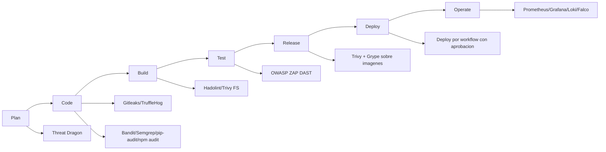

### 7.1 Lectura pedagogica del pipeline

- Plan: se anticipan amenazas antes de codificar.
- Code: se bloquea fuga de secretos y patrones inseguros.
- Build: se valida higiene de artefactos contenerizados.
- Test: se evalua la aplicacion corriendo.
- Release/Deploy: se promueve solo lo escaneado.
- Operate: se mantiene vigilancia continua.

---

## 8. Riesgos identificados, mitigaciones y brechas residuales

| Riesgo | Mitigacion actual | Brecha residual | Recomendacion |
|---|---|---|---|
| Token en localStorage | JWT con expiracion + deteccion de sesion expirada en polling | Exposicion ante XSS | Migrar a cookies HttpOnly + CSRF defense |
| Trafico HTTP | Entorno local controlado | Sin TLS en despliegue remoto si no se configura | Forzar HTTPS en gateway/ingress |
| Clave Fernet no persistente por defecto | Soporte de `ENCRYPTION_KEY` | Riesgo de perdida de descifrado si no se fija clave | Gestionar clave en secret manager |
| Secretos en codigo/commits | Hooks + CI secret scanning | Falso negativo posible | Politica de rotacion y deteccion continua |
| Abuso de API | Rate limiting en Vault (10/min) | Aun sin WAF dedicado | Extender limites por ruta y reputacion IP |
| Runtime compromise | Falco con reglas base | Necesita tuning por entorno | Ajustar reglas y alertas integradas |
| Fuerza bruta en login | Bloqueo Redis tras 3 intentos (HTTP 423, TTL 300s) + notificacion email | Redis sin autenticacion en entorno local | Activar `requirepass` en Redis de produccion |
| Token de recovery en URL (logs proxy) | Token OTP de un solo uso con TTL corto | Token visible en historial del navegador | Eliminar token del URL tras primer uso |
| CVE en `cryptography 41.0.7` | Fernet (AES+HMAC) no usa las funciones vulnerables (RSA/ECDH) | Superficie OpenSSL en el wheel | Actualizar a `>=43.0.1` (P1 del plan de remediacion) |
| CVE en `Jinja2 3.1.2` | Templates internos sin entrada de usuario | Sandbox breakout si se expusieran templates | Actualizar a `>=3.1.6` (P2 del plan de remediacion) |

---

## 9. Evidencia visual: capturas de pantalla por seccion

Las siguientes evidencias visuales se encuentran integradas en este documento.

### Evidencia visual 1: Frontend login
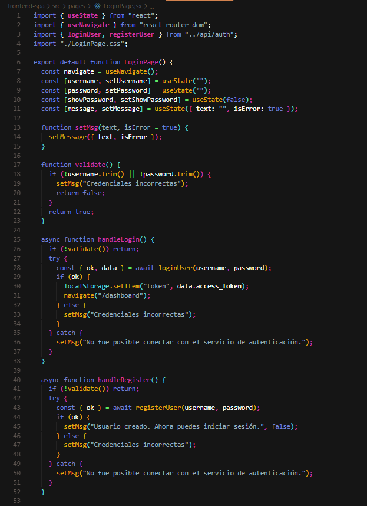

### Evidencia visual 2: Auth JWT y bcrypt
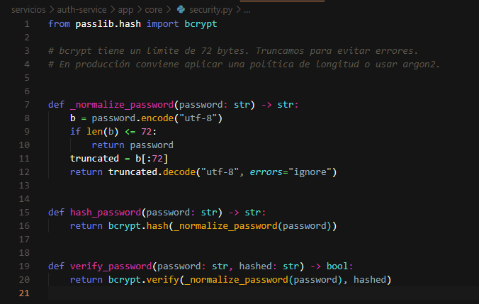

### Evidencia visual 3: Vault crypto y rate limit
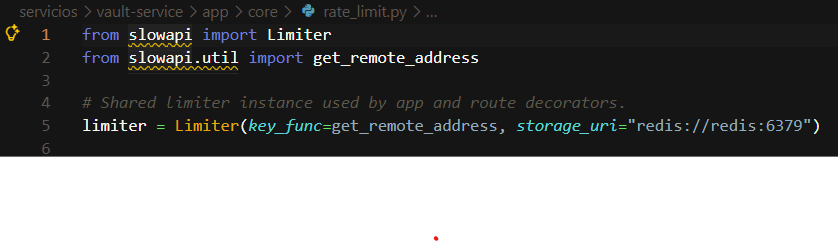

### Evidencia visual 4: Worker queue y expiracion
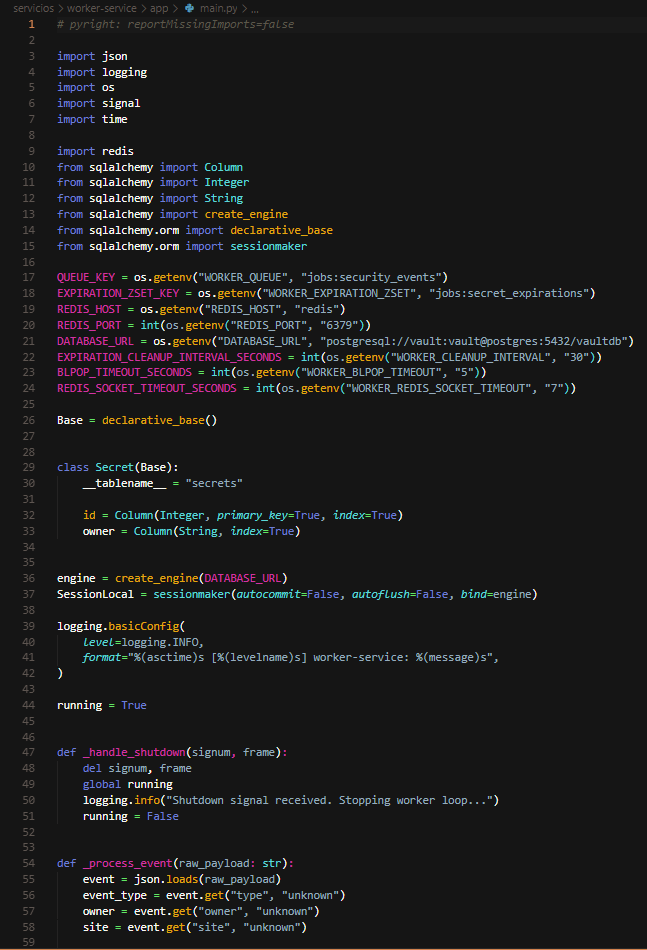

### Evidencia visual 5: PostgreSQL y Redis en compose
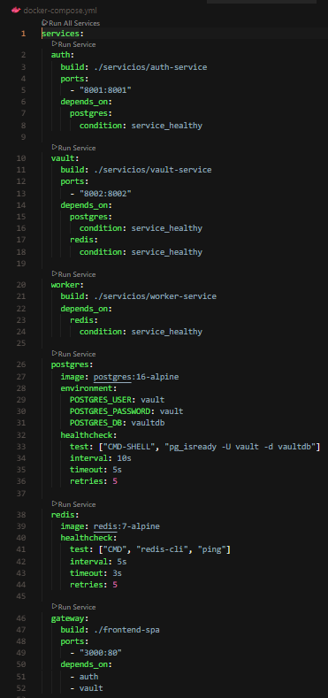

### Evidencia visual 6: Gateway Nginx rutas
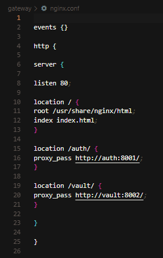

### Evidencia visual 7: IaC y orquestacion
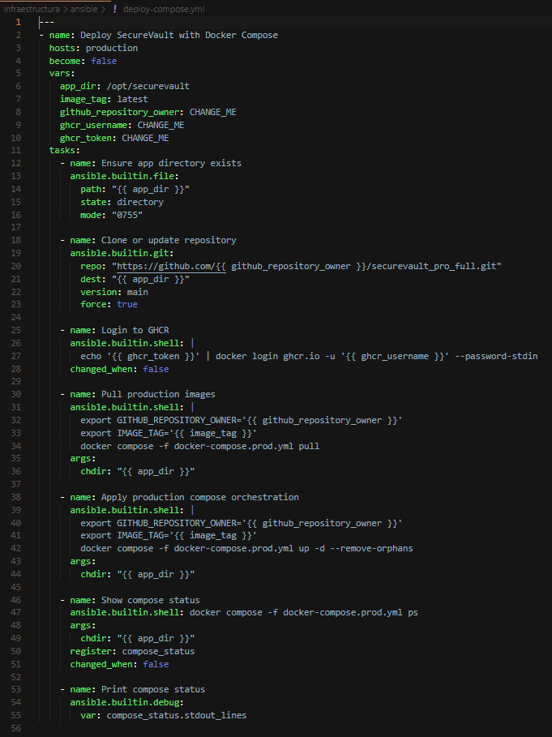

### Evidencia visual 8: Workflow CI DevSecOps
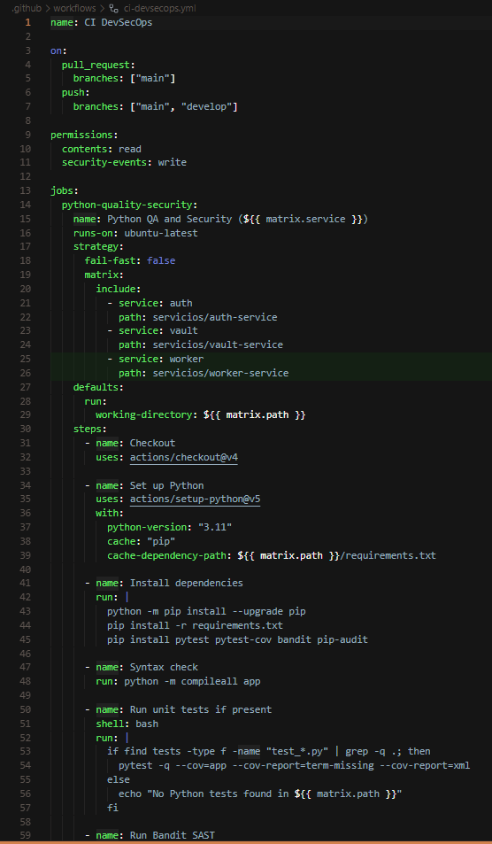

### Evidencia visual 9: Workflow DAST ZAP
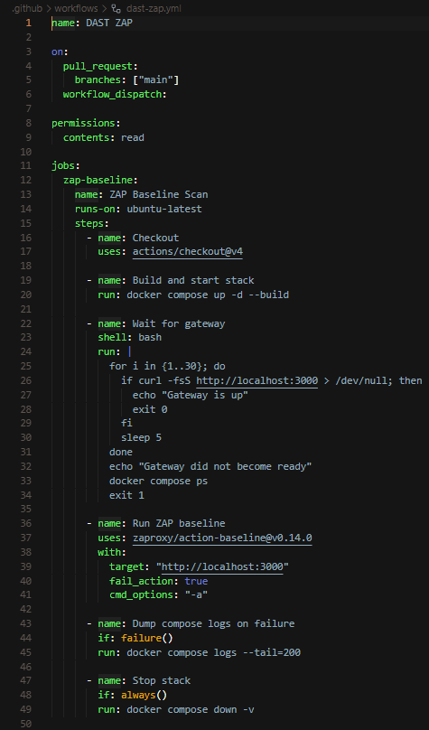

### Evidencia visual 10: Monitoring stack
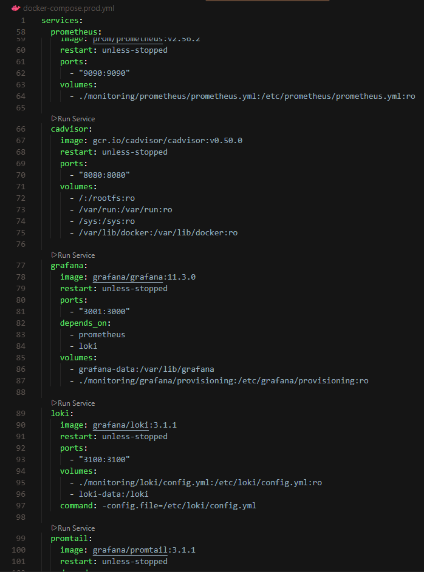

### Evidencia visual 11: Threat model files
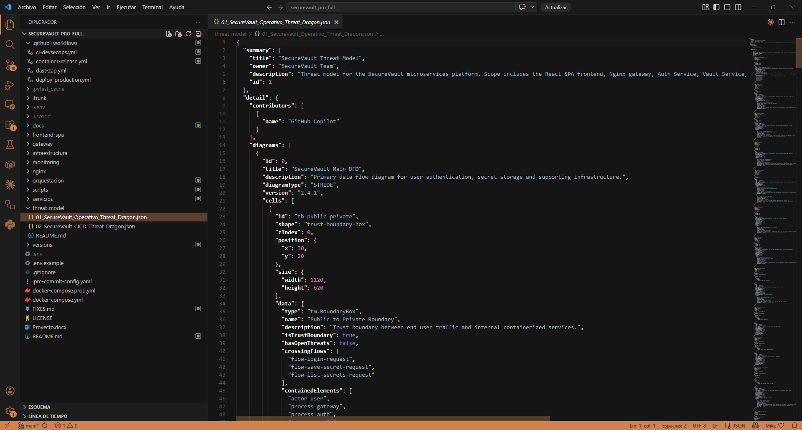

### Evidencia visual 12: Security matrix docs
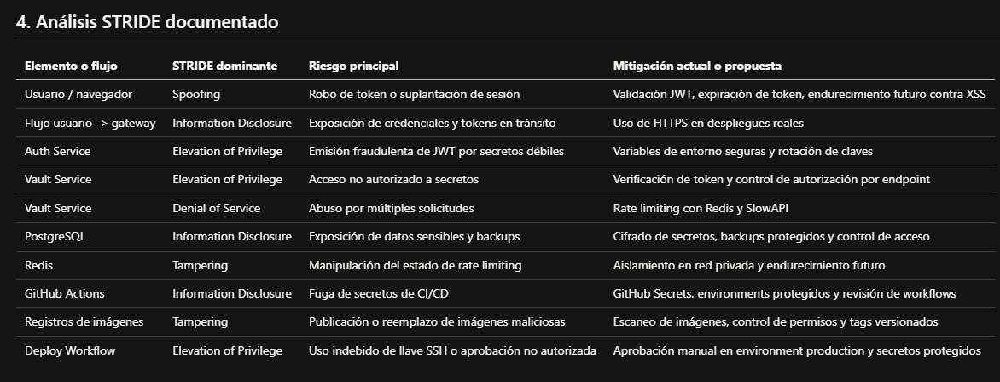

---

## 10. Conclusiones y recomendaciones

SecureVault Pro demuestra una implementacion madura para contexto academico-profesional: seguridad en capas, pipeline automatizado, escaneo de codigo/dependencias/imagenes, y monitoreo operativo continuo.

Fortalezas:
- Defensa en profundidad aplicada de forma practica.
- Cobertura amplia de controles DevSecOps.
- Estructura modular clara y reproducible.
- Documentacion alineada con evidencia tecnica.
- Controles de seguridad ampliados en v1.2: bloqueo de cuentas, recovery por email, JWT diferenciado por rol, deteccion proactiva de sesion expirada.
- Escaneos locales (Bandit, OSV API) confirman: 0 hallazgos HIGH en codigo propio; CVEs de dependencias sin impacto real en la funcionalidad usada.

Recomendaciones prioritarias para evolucion a produccion estricta:
1. **P1**: Actualizar `cryptography` a `>=43.0.1` (vault-service) y `Jinja2` a `>=3.1.6` (auth-service).
2. Migrar gestion de sesion a cookies HttpOnly y reforzar CSP.
3. Habilitar TLS de extremo a extremo en todos los entornos remotos.
4. Externalizar secretos a gestor dedicado (por ejemplo, Vault/KMS).
5. Integrar alertamiento formal (correo/chat/siem) para eventos de Falco y umbrales de Prometheus.
6. Definir politica de rotacion de claves y respuesta a incidentes versionada.
7. Corregir ESLint warnings en `App.jsx` y `LoginPage.jsx` para que CI DevSecOps pase en estado PASS completo.
8. Actualizar GitHub Actions a versiones compatibles con Node.js 24 (antes de junio 2026).

---

## 11. Anexos

## Anexo A. Diagrama de flujos de datos de seguridad

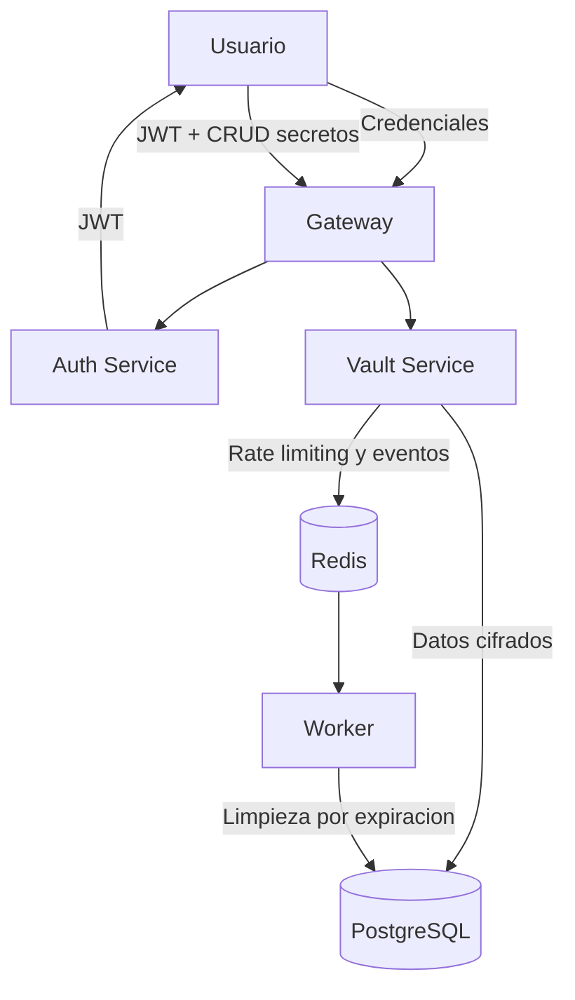

## Anexo B. Matriz herramienta vs politica vigilada

| Herramienta | Tipo | Politica vigilada principal | Estado en v1.2 |
|---|---|---|---|
| Threat Dragon | Modelado de amenazas | Analisis preventivo de riesgo | ✅ Modelos actualizados |
| Gitleaks | Secret scanning | Prevencion de fuga de credenciales | ✅ PASS en CI (sin secretos) |
| TruffleHog | Secret scanning | Prevencion de fuga de credenciales | ⚠️ Falso positivo en CI (Gitleaks confirma limpio) |
| Bandit | SAST Python | Codigo seguro | ✅ 0 HIGH, 1 MEDIUM (bajo riesgo real) |
| Semgrep | SAST multi-lenguaje | Codigo seguro | ✅ PASS en CI |
| OSV API / pip-audit | SCA Python | Dependencias seguras | ⚠️ Jinja2/cryptography con CVEs (remediacion pendiente) |
| npm audit / OSV API | SCA JavaScript | Dependencias seguras | ⚠️ Vite 12 CVEs dev-only (no impacta produccion) |
| Dependency-Check OWASP | SCA multi-ecosistema | Dependencias seguras | ✅ PASS en CI |
| Hadolint | Lint de contenedor | Dockerfiles robustos | ✅ PASS (advertencia DL3059 menor) |
| Trivy | Escaneo de imagenes/FS | Artefactos libres de CVEs criticos | ✅ PASS en CI |
| Checkov | IaC scan | Infraestructura segura | ✅ PASS en CI |
| OWASP ZAP | DAST | Seguridad en ejecucion | Workflow disponible |
| Prometheus/Grafana | Observabilidad | Disponibilidad y comportamiento | Configurado en prod |
| Loki/Promtail | Logging | Trazabilidad operativa | Configurado en prod |
| Falco | Runtime security | Deteccion temprana de comportamiento anomalo | Configurado en prod |

