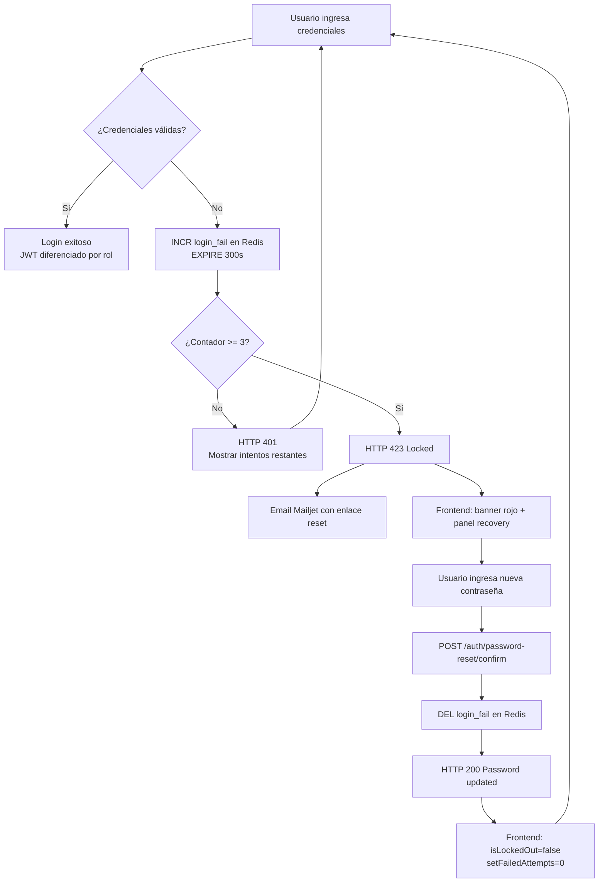
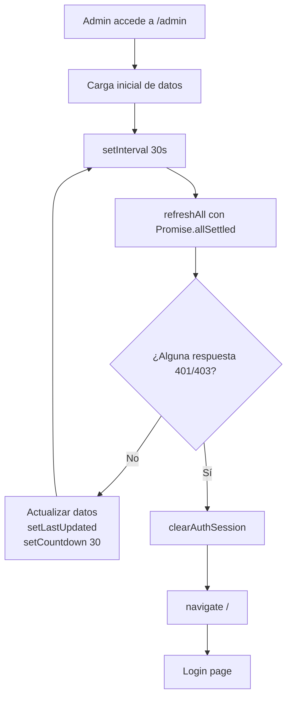

# Análisis de Cambios — SecureVault Pro v1.0 → v1.2

## 1. Resumen ejecutivo

La versión 1.2 de SecureVault Pro incorpora cuatro mejoras de seguridad y operación que no estaban presentes en v1.0:

1. **Bloqueo de cuenta por intentos fallidos** con notificación automática por email.
2. **Recuperación de contraseña con limpieza de bloqueo** — el reset desbloquea la cuenta.
3. **Expiración diferenciada de JWT por rol** — admin 8 h, user 60 min.
4. **Panel de administración con actualización automática y detección de sesión expirada**.

---

## 2. Tabla comparativa de cambios

| Funcionalidad | v1.0 | v1.2 |
|---------------|------|------|
| Bloqueo de cuenta | ✗ No existe | ✅ HTTP 423 tras 3 intentos, Redis TTL 5 min |
| Contador de intentos | ✗ No existe | ✅ Visible en frontend: "Te quedan X intentos" |
| Email de recuperación | ✗ No existe | ✅ Mailjet: HTML con enlace directo y token de reset |
| Reset limpia bloqueo | ✗ No existe | ✅ `redis_client.delete(f"login_fail:{email}")` al confirmar reset |
| Frontend reactivo al bloqueo | ✗ No existe | ✅ Banner rojo + panel recovery auto + `isLockedOut` state |
| Expiración JWT | 60 min (todos) | ✅ 60 min (user) / 480 min (admin) |
| Panel admin — actualización | Manual (F5) | ✅ Automática cada 30 s con countdown |
| Panel admin — sesión expirada | Sin detección | ✅ 401/403 → clearAuthSession + navigate("/") |
| `SessionExpiredError` | ✗ No existe | ✅ Clase custom para distinguir expiración de errores de red |
| Variables de configuración | `TOKEN_EXP_MINUTES` | ✅ + `ADMIN_TOKEN_EXP_MINUTES`, `MAILJET_*` |

---

## 3. Cambios por componente

### 3.1 `servicios/auth-service/app/core/config.py`

```python
# v1.0
token_exp_minutes: int = 60

# v1.2
token_exp_minutes: int = 60
admin_token_exp_minutes: int = 480  # 8 horas para administradores
```

Nuevas variables:

```python
mailjet_api_key: str = ""
mailjet_secret_key: str = ""
mailjet_sender_email: str = ""
mailjet_sender_name: str = "SecureVault Pro"
```

### 3.2 `servicios/auth-service/app/utils/jwt.py`

```python
# v1.0 — ignoraba exp_minutes
def create_access_token(data: dict):
    expire = datetime.utcnow() + timedelta(minutes=settings.token_exp_minutes)
    ...

# v1.2 — acepta exp_minutes por parámetro
def create_access_token(data: dict, exp_minutes: int | None = None):
    minutes = exp_minutes if exp_minutes is not None else settings.token_exp_minutes
    expire = datetime.utcnow() + timedelta(minutes=minutes)
    ...
```

### 3.3 `servicios/auth-service/app/services/auth_service.py`

```python
# v1.2 — selecciona exp según rol
def build_access_token(user: User, db: Session | None = None) -> str:
    exp_minutes = (
        settings.admin_token_exp_minutes if user.role == "admin"
        else settings.token_exp_minutes
    )
    token = create_access_token(
        {"user": user.email, "role": user.role, "sub": str(user.id), "jti": session_jti},
        exp_minutes=exp_minutes,
    )
```

### 3.4 `servicios/auth-service/app/routers/auth.py`

**Nuevo: limpieza de Redis al confirmar reset**

```python
# v1.2 — en password_reset_confirm
from ..core.config import redis_client
from ..services.auth_service import normalize_email
try:
    if redis_client:
        normalized_email = normalize_email(payload.email)
        redis_client.delete(f"login_fail:{normalized_email}")
except Exception:
    pass
return {"msg": "Password updated"}
```

**Nuevo: bloqueo en login (ya existía en v1.0 parcialmente, ahora completo con email)**

```python
# En cada intento fallido:
redis_client.incr(f"login_fail:{email}")
redis_client.expire(f"login_fail:{email}", 300)
# En el 3er intento:
await send_reset_email(email, token, locked_out=True)
raise HTTPException(status_code=423, detail="Account locked")
```

### 3.5 `servicios/auth-service/app/utils/email_service.py`

Nuevo parámetro `locked_out`:

```python
# v1.2
async def send_reset_email(email: str, token: str, locked_out: bool = False):
    login_url = f"http://localhost:3000/?reset_token={token}&email={email}"
    # Genera HTML diferente si locked_out=True (cabecera roja, asunto de bloqueo)
```

### 3.6 `frontend-spa/src/api/users.js`

**Nuevo: `SessionExpiredError` y `adminFetch`**

```javascript
// v1.2 — detecta 401/403 y lanza clase específica
export class SessionExpiredError extends Error {
  constructor() {
    super("Sesión expirada o revocada");
    this.isSessionExpired = true;
  }
}

async function adminFetch(url, options = {}) {
  const res = await fetch(url, { headers: authHeaders(), ...options });
  if (res.status === 401 || res.status === 403) throw new SessionExpiredError();
  if (!res.ok) throw new Error(`Request failed: ${res.status}`);
  return res.json();
}
```

### 3.7 `frontend-spa/src/pages/AdminPage.jsx`

**Nuevos states:**

```javascript
const [lastUpdated, setLastUpdated] = useState(null);
const [countdown, setCountdown] = useState(POLL_INTERVAL);
const selectedUserIdRef = useRef(null);
```

**Nuevo: polling con `refreshAll`**

```javascript
const POLL_INTERVAL = 30;

const refreshAll = useCallback(async () => {
  const results = await Promise.allSettled([loadUsers(), loadActiveSessions(), loadAuditLogs()]);
  for (const r of results) {
    if (r.status === "rejected" && r.reason?.isSessionExpired) {
      clearAuthSession();
      navigate("/");
      return;
    }
  }
  setLastUpdated(new Date());
  setCountdown(POLL_INTERVAL);
}, [...]);

// Polling useEffect
useEffect(() => {
  const id = setInterval(refreshAll, POLL_INTERVAL * 1000);
  return () => clearInterval(id);
}, [refreshAll]);

// Countdown useEffect
useEffect(() => {
  const id = setInterval(() => setCountdown(c => (c <= 1 ? POLL_INTERVAL : c - 1)), 1000);
  return () => clearInterval(id);
}, []);
```

**Nuevo: UI topbar con indicador**

```jsx
<div className="admin-refresh-indicator">
  <span className="refresh-countdown">Actualizando en {countdown}s</span>
  <span className="refresh-time">{lastUpdated ? `Última act.: ${formatRelative(lastUpdated)}` : ""}</span>
  <button onClick={refreshAll}>Actualizar ahora</button>
</div>
```

### 3.8 `frontend-spa/src/pages/LoginPage.jsx`

**Nuevo: detección de bloqueo y recovery**

```javascript
// En handleLogin:
if (res.status === 423) {
  setIsLockedOut(true);
  setShowRecovery(true);
}
if (res.status === 401) {
  setFailedAttempts(p => p + 1);
}

// En handleResetPassword (bloque if ok):
setIsLockedOut(false);
setFailedAttempts(0);

// useEffect detecta ?reset_token= en URL:
if (resetToken && email) {
  setRecoveryToken(resetToken);
  setRecoveryEmail(email);
  setIsLockedOut(true);
  setShowRecovery(true);
}
```

---

## 4. Flujo de bloqueo de cuenta — Nuevo en v1.2



## 5. Flujo de polling y expiración — Nuevo en v1.2



---

## 6. Impacto en seguridad

| Vector | v1.0 | v1.2 | Mejora |
|--------|------|------|--------|
| Fuerza bruta de contraseñas | Sin protección | HTTP 423 + Redis TTL | Mitiga ataques de diccionario |
| Sesión admin prolongada | 60 min (igual que user) | 480 min diferenciado | Experiencia admin mejorada sin over-privileged exposure |
| Sesión admin post-expiración | Sin detección | Detección 401/403 + redirect | Cierra ventana de sesión zombi |
| Notificación de bloqueo | Sin email | Email automático con enlace | Notificación al usuario legítimo |
| Reset limpia bloqueo | No | Sí (DEL Redis) | Flujo de recuperación completo |

---

## 7. Cambios en variables de entorno

| Variable | v1.0 | v1.2 | Descripción |
|----------|------|------|-------------|
| `TOKEN_EXP_MINUTES` | `60` | `60` | Sin cambio (user regular) |
| `ADMIN_TOKEN_EXP_MINUTES` | ✗ | `480` | **Nueva** — Expiración admin |
| `MAILJET_API_KEY` | ✗ | requerida | **Nueva** — Envío de emails |
| `MAILJET_SECRET_KEY` | ✗ | requerida | **Nueva** — Clave Mailjet |
| `MAILJET_SENDER_EMAIL` | ✗ | requerida | **Nueva** — Email remitente |
| `MAILJET_SENDER_NAME` | ✗ | opcional | **Nueva** — Nombre remitente |

---

## 8. Instrucciones de migración (v1.0 → v1.2)

Si ya tiene un entorno v1.0 corriendo, para actualizar a v1.2:

1. **Agregar variables de entorno** en `docker-compose.yml` para el servicio `auth`:
   ```yaml
   environment:
     ADMIN_TOKEN_EXP_MINUTES: 480
     MAILJET_API_KEY: <su_api_key>
     MAILJET_SECRET_KEY: <su_secret_key>
     MAILJET_SENDER_EMAIL: <su_email>
   ```

2. **Actualizar imagen** (si usa Docker Hub):
   ```powershell
   $env:IMAGE_TAG = "v1.2.0"
   docker compose -f docker-compose.prod.yml pull
   docker compose -f docker-compose.prod.yml up -d
   ```

3. **Verificar Redis** — no requiere migración de datos; las claves `login_fail:*` se crean dinámicamente.

4. **Verificar base de datos** — la tabla `auth_session` ya existe desde v1.0; no hay cambio de esquema.

5. **Limpiar caché de navegador** — el frontend SPA tiene nuevos estados; recargar con Ctrl+F5.

---

## 9. Casos de prueba nuevos (resumen)

Ver `docs/05_Plan_Pruebas.md` secciones 4, 5 y 6 para los casos completos:

- CP-12: Bloqueo por 3 intentos → HTTP 423
- CP-13: Email de recovery al bloquearse
- CP-14: Reset con token → Redis limpiado
- CP-15: Login exitoso post-reset
- CP-16: Frontend desbloquea estado visual
- CP-17: Token admin con `exp` = 480 min
- CP-18: Token user con `exp` = 60 min
- CP-19: Redirect al expirar sesión admin
- CP-20 a CP-24: Panel admin polling y operaciones

---

## 10. Remediaciones de seguridad DevSecOps (P1–P9)

Tras implementar las funcionalidades de v1.2, se realizó una auditoría de seguridad completa con herramientas SAST y SCA. Los resultados iniciales revelaron 10 CVEs y 1 hallazgo MEDIUM de Bandit. Las remediaciones se aplicaron en nueve pasos (P1–P9), con commits rastreables en el repositorio.

### 10.1 Tabla de remediaciones aplicadas

| ID | Herramienta | Hallazgo inicial | Solución aplicada | Resultado |
|----|-------------|-----------------|-------------------|-----------|
| P1 | SCA (OSV) | `cryptography 41.0.7` — 7 CVEs (3 HIGH, 2 MOD, 2 LOW) | Actualizar a `43.0.1` | Parcial — 3 CVEs residuales |
| P2 | SCA (OSV) | `Jinja2 3.1.2` — 1 CVE HIGH (GHSA-h75v-3vvj-5mfj) | Actualizar a `3.1.6` | ✅ 0 CVEs |
| P3 | SCA (OSV) | `vite 5.3.5` — 5 CVEs | Actualizar a `6.2.6` | ✅ 0 CVEs en v6.2.6 |
| P4 | ESLint | Warnings prop-types/react-hooks en frontend | Corregir `App.jsx` y `LoginPage.jsx` | ✅ 0 warnings |
| P5 | SAST Bandit B310 | `urllib.request.urlopen()` MEDIUM en vault-service | Migrar a `httpx` | ✅ 0 MEDIUM |
| P6 | CI/CD | Node.js 20 en GitHub Actions | Actualizar a Node.js 24 (LTS actual) | ✅ Actualizado |
| P7 | CI/CD | TruffleHog sin `--results=verified` | Agregar flag `--results=verified` | ✅ Menos falsos positivos |
| P8 | SCA (OSV) | `cryptography 43.0.1` — 3 CVEs residuales | Actualizar a versión mayor `46.0.7` | ✅ 0 CVEs |
| P9 | SCA (OSV) | `vite 6.2.6` — 1 CVE MODERATE | Actualizar a `6.3.4` | 5 CVEs residuales (dev-server) |

### 10.2 Estado final de dependencias

| Paquete | Versión inicial | Versión final | CVEs inicial | CVEs final |
|---------|----------------|---------------|:---:|:---:|
| `cryptography` | `41.0.7` | **`46.0.7`** | 7 | **0** ✅ |
| `Jinja2` | `3.1.2` | **`3.1.6`** | 1 | **0** ✅ |
| `vite` | `5.3.5` | **`6.3.4`** | 5 | 5 (dev-server) |
| Todas las demás | — | sin cambio | 0 | **0** ✅ |

### 10.3 Resultado final SAST — Bandit v1.9.4

| Severidad | Pre-remediación | Post-remediación |
|-----------|:---:|:---:|
| HIGH | 0 | **0** ✅ |
| MEDIUM | 1 (B310 urllib) | **0** ✅ |
| LOW | 56 | 56 (B101 assert en tests, B110 except-pass Redis) |

### 10.4 Notas sobre CVEs residuales de vite 6.3.4

Los 5 CVEs residuales afectan **exclusivamente al servidor de desarrollo** (`vite dev`, `--host`). SecureVault Pro utiliza Vite **solo como herramienta de build**: el contenedor de producción sirve archivos estáticos compilados mediante Nginx (multi-stage build). El riesgo en producción es **nulo**.

Actualizar a `vite 8.x` (fix completo) introduce cambios breaking en CJS interop, minificación y `manualChunks` — evaluado y pospuesto por riesgo de regresión sin beneficio de seguridad en producción.

Ver análisis detallado en [docs/04_Seguridad_y_Riesgos.md](04_Seguridad_y_Riesgos.md) sección 10.
