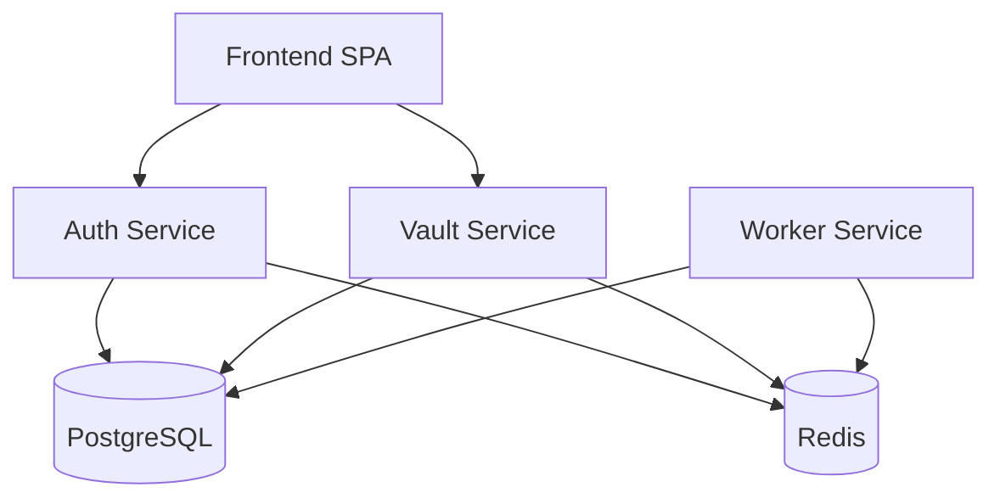

# SecureVault Pro - Avance 1 (MVP Funcional + Base DevSecOps)


## Descripcion
SecureVault Pro es una plataforma base de gestion de secretos, orientada a seguridad desde el dia 1. Este Avance 1 entrega un MVP funcional con autenticacion JWT, cifrado de secretos, limpieza automatica por worker, contenedorizacion completa y pipeline DevSecOps inicial.

## Estado actual del avance
- MVP funcional: completado
- Estructura obligatoria del repositorio: completada
- Pipeline CI/CD base: completado
- Documentacion inicial: completada
- Informe PDF: pendiente de generar con evidencias

## Tecnologias usadas
- Frontend: React + Vite
- Backend: Node.js + Express (microservicios)
- Base de datos: PostgreSQL
- Broker/cache: Redis
- Seguridad: JWT, Helmet, rate-limit, AES-256-GCM
- DevSecOps: GitHub Actions, Gitleaks, Semgrep, Trivy
- IaC/Orquestacion: Ansible + Docker Swarm base

## Quick Start
```bash
cp .env.example .env
docker compose up --build
```

### URLs
- Frontend: http://localhost:5173
- Auth Service: http://localhost:3001/health
- Vault Service: http://localhost:3002/health
- Worker Service: http://localhost:3003/health

## Diagrama de componentes (Mermaid)


## Estructura principal
```text
Securevault-pro/
├── LICENSE
├── README.md
├── docker-compose.yml
├── docker-compose.prod.yml
├── .github/workflows/ci-cd.yml
├── infraestructura/ansible/site.yml
├── orquestacion/docker-swarm.yml
├── servicios/
│   ├── auth-service/
│   ├── vault-service/
│   └── worker-service/
├── frontend-spa/
└── docs/
```

## Documentacion
- docs/01_Arquitectura.md
- docs/02_Desarrollo.md
- docs/03_Despliegue.md
- docs/04_Seguridad.md
- docs/05_Usuario.md
- docs/06_Checklist_Avance1.md

## Plan sugerido de 7 dias
- Dia 1: estructura y worker base
- Dia 2: compose y flujo login -> secreto
- Dia 3: pipeline DevSecOps
- Dia 4: diagramas + threat modeling
- Dia 5: documentacion
- Dia 6: escaneos y hardening
- Dia 7: informe PDF final
