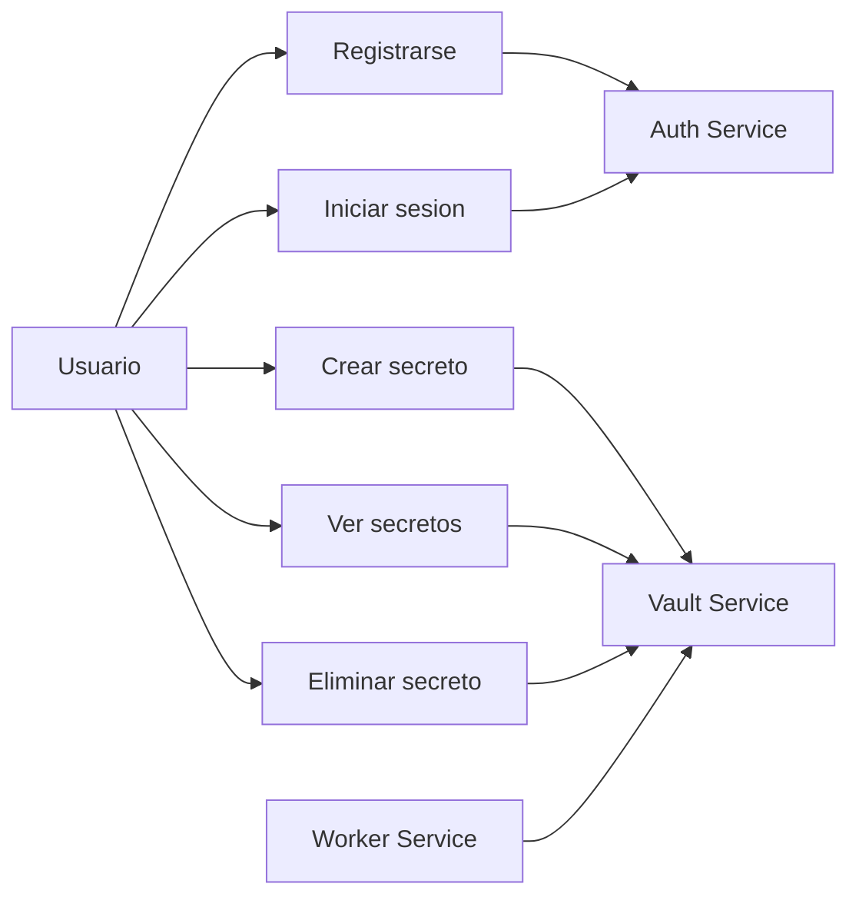
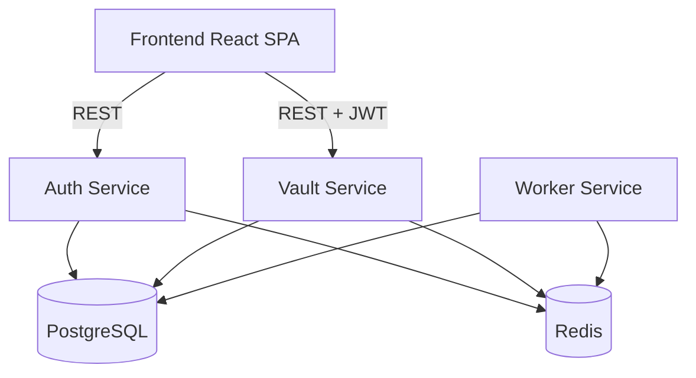
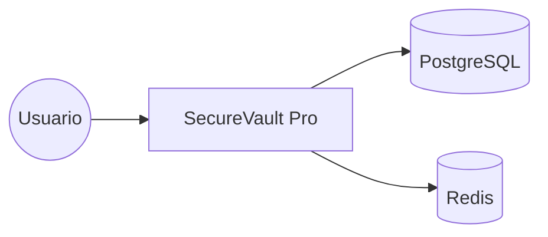
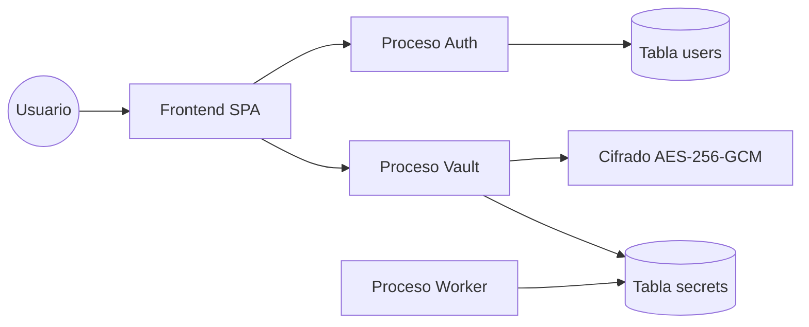

# Manual de Arquitectura

## Vision general
SecureVault Pro implementa una arquitectura de microservicios para gestionar secretos con cifrado de datos en reposo y autenticacion basada en JWT.

## Casos de uso (Mermaid)

## Diagrama de componentes (Mermaid)

## DFD Nivel 0 (Mermaid)

## DFD Nivel 1 (Mermaid)

