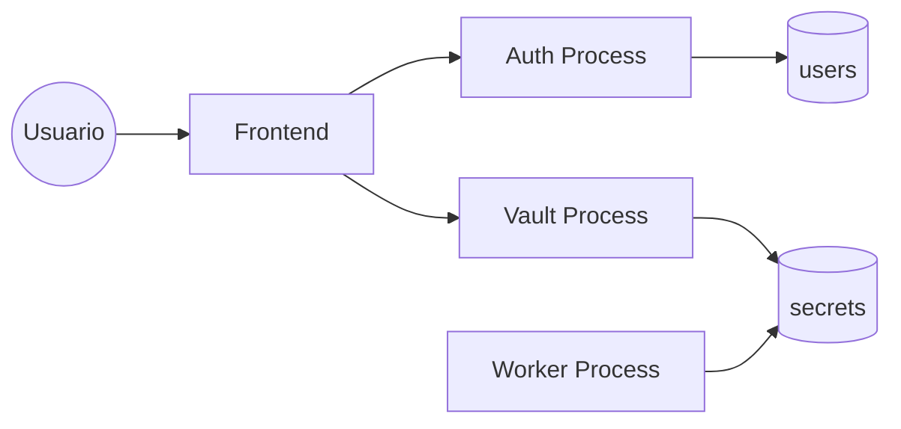

# DFD Nivel 1

```mermaid
flowchart LR
  User((Usuario)) --> FE[Frontend]
  FE --> AuthP[Auth Process]
  FE --> VaultP[Vault Process]
  AuthP --> Users[(users)]
  VaultP --> Secrets[(secrets)]
  Worker[Worker Process] --> Secrets
```
